# News Feed

Designing a news feed / timeline system (Twitter/X, Facebook, Instagram) is arguably the most iconic system design question. It tests your understanding of fan-out strategies, ranking algorithms, caching at scale, and the tension between write amplification and read latency. On the mobile side, it's the highest-traffic screen in any social app -- every millisecond of scroll jank, every unnecessary network call, every dropped frame costs engagement. The core challenge: when a user opens their feed, show them the most relevant posts from people they follow -- in under 500ms, for 500M+ daily active users, with 60fps scrolling and full offline support.

This article covers both the backend distributed system and the mobile client architecture in a single walkthrough, because in practice these two halves deeply influence each other.

---

## Scoping the Problem

The first thing I'd want to nail down is whether we're building a chronological or ranked feed -- because a ranked feed requires an ML scoring pipeline, which is a fundamentally different beast. I'd also ask about the follow model: asymmetric follow (Twitter) vs symmetric friendship (Facebook) changes the social graph and fan-out semantics.

Next, I'd ask about celebrity/influencer accounts. A user with 50M followers creates a massive fan-out problem. This single question changes the entire write path. Content types matter too -- text-only is straightforward, but images/video require media processing, CDN delivery, and different storage strategies.

On the mobile side, I'd pin down offline reading support (determines caching depth), whether we need real-time push or pull-to-refresh (battery implications), and video autoplay policy (memory management, bandwidth).

Other questions that meaningfully change the design:

- **Real-time updates or pull-to-refresh?** Real-time requires push infrastructure (WebSocket/SSE). Pull-to-refresh is simpler and sufficient for most feeds.
- **Content moderation?** Pre-publish moderation adds latency; post-publish needs a pipeline to retroactively remove content from feeds.
- **Ads integration?** Ad injection requires a separate ranking step and auction system.
- **Data saver / low bandwidth mode?** Image quality negotiation, prefetch tuning.

!!! tip "Pro Tip"
    Start with: *"I'll design for asymmetric follow (Twitter-like), ranked feed with text and images, 500M DAU, with celebrity accounts. I'll mention ads and moderation but won't deep-dive unless you'd like."* This scopes the problem while showing you understand the hard parts.

**Core scope:** Asymmetric follow, ranked feed with text + images, 500M DAU, celebrity accounts, offline mobile support, pull-to-refresh with optional real-time "new posts" banner.

**Key non-functional priorities:**

- **Feed load latency** -- < 500ms (p99). Every 100ms matters for engagement.
- **Availability** -- 99.99%. Feed is the core product surface.
- **Consistency** -- Eventual. A post appearing 5-30s late in followers' feeds is acceptable.
- **Mobile scroll performance** -- 60fps, zero dropped frames.
- **Offline browsing** -- full cached feed available without network.
- **Battery efficiency** -- < 5% battery/hour of active use.

**Capacity math that actually matters:** At 500M DAU with 0.5 posts/user/day and 200 avg followers, fan-out-on-write generates ~580K Redis writes/sec average, ~2.9M at peak. But celebrities with 50M followers make pure push infeasible -- one celebrity post = 50M writes. If 50K celebrities post once/day, that's 2.5 *trillion* writes/day. This single insight drives the entire architecture toward a hybrid fan-out model.

!!! warning "Edge Case"
    The celebrity fan-out number (2.5T writes/day) is the single most important insight in this estimation. Call it out explicitly -- it shows you understand the core problem.

---

## API Design

### Protocol Choice

I'd use REST for the external feed API and gRPC for internal service-to-service communication. REST is the pragmatic choice because feed responses are highly cacheable at the CDN/proxy layer, well-supported by all clients, and straightforward to version. If mobile bandwidth optimization were a key concern, I'd consider GraphQL for the feed endpoint specifically -- Instagram uses it heavily for its complex content types.

| Protocol | Feed Use Case | Pros | Cons |
|----------|--------------|------|------|
| **REST** | External feed API | Cacheable, simple, CDN-friendly | Over-fetching, multiple round trips |
| **GraphQL** | Complex nested content | Client specifies exact fields, single request | Harder to cache, complexity overhead |
| **gRPC** | Internal service calls | Fast (protobuf), streaming, strong typing | Not browser-friendly |

### Feed Delivery: Pull vs Push

Most feed systems (Twitter, Instagram, Facebook) use pull-to-refresh as the primary mechanism. The client fetches the feed on app open and on pull-to-refresh. For important updates, a lightweight push signal tells the client "new posts available" without streaming the full content.

| Approach | Latency | Server Cost | Best For |
|----------|---------|-------------|----------|
| **Pull-to-refresh** | User-controlled | Low | Primary mechanism for all feeds |
| **SSE nudge** | Low | Moderate | "3 new posts" banner |
| **WebSocket** | Very low | Moderate | Overkill for feeds (mostly one-way) |

!!! note "Industry Insight"
    Twitter uses a pull model for the home timeline. The "New posts available" banner at the top is a lightweight push signal -- it doesn't stream posts in real time. Facebook similarly pre-computes feeds and serves from cache on pull.

### Key Endpoints

```
POST   /v1/posts                        -- Create a new post
GET    /v1/feed?cursor=X&limit=20       -- Home feed (cursor-paginated)
GET    /v1/feed/updates?since=T         -- New post count since timestamp
GET    /v1/users/{user_id}/posts        -- Profile feed
POST   /v1/posts/{post_id}/like         -- Like a post
POST   /v1/media/upload                 -- Upload media, returns media_url
```

### Cursor-Based Pagination

Offset-based pagination (`?page=2`) breaks when new posts are inserted -- users see duplicates or miss posts. The cursor encodes `timestamp + post_id` for uniqueness (two posts can share the same millisecond timestamp):

```
cursor = base64("1700000000000_post_abc123")
```

Response shape:

```json
{
  "posts": [
    {
      "post_id": "post_xyz789",
      "author": {
        "user_id": "user_42",
        "username": "sandesh",
        "avatar_url": "https://cdn.example.com/avatars/42.jpg"
      },
      "content": "Just deployed a new fan-out service...",
      "media": [{
        "url": "https://cdn.example.com/media/img_001.jpg",
        "type": "image",
        "blurhash": "LEHV6nWB2yk8pyo0adR*.7kCMdnj",
        "width": 1200, "height": 800
      }],
      "metrics": { "likes": 1420, "comments": 89 },
      "is_liked": true,
      "created_at": "2025-11-14T10:30:00Z"
    }
  ],
  "next_cursor": "MTcwMDAwMDAwMDAwMF9wb3N0X3h5ejc4OQ==",
  "has_more": true
}
```

!!! tip "Pro Tip"
    While the personalized feed itself can't be CDN-cached (`Cache-Control: private`), individual post objects and media can. Use aggressive CDN caching for `GET /posts/{id}` and media URLs -- this offloads the majority of bandwidth from your origin servers. Use `ETag` / `If-None-Match` on feed responses so the client can get a `304 Not Modified` when nothing has changed.

---

## Backend Architecture

### System Overview

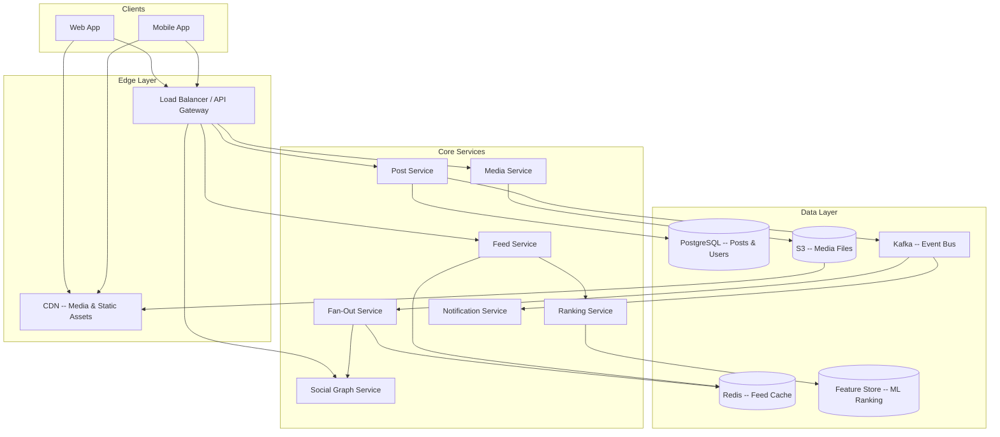

**Data store selection:**

| Store | Used For | Why This Store |
|-------|----------|----------------|
| **PostgreSQL** | Posts, users, social graph | Relational integrity, strong consistency for core data. At ~2,900 posts/sec avg write throughput, PostgreSQL handles this comfortably. |
| **Redis (Sorted Sets)** | Feed cache, counters, rate limiting | Sub-ms reads, sorted sets for ranked feeds, TTL for cache management |
| **S3 + CDN** | Images, videos, thumbnails | Cheap blob storage + global edge delivery |
| **Kafka** | Event streaming | Ordered, durable, decouples write path from fan-out; replayable |
| **Feature Store** | ML ranking features | Low-latency feature serving for real-time ranking |

!!! tip "Pro Tip"
    The social graph is a common interview trap. Interviewers may push you toward Neo4j. For a follow/following relationship, PostgreSQL with proper indexing is sufficient up to billions of edges. Graph databases shine for multi-hop queries (friends-of-friends), not simple adjacency lookups. State this trade-off explicitly.

### Fan-Out Strategies -- THE Core Problem

Every architectural decision flows from: *"When a user publishes a post, how does it reach their followers' feeds?"*

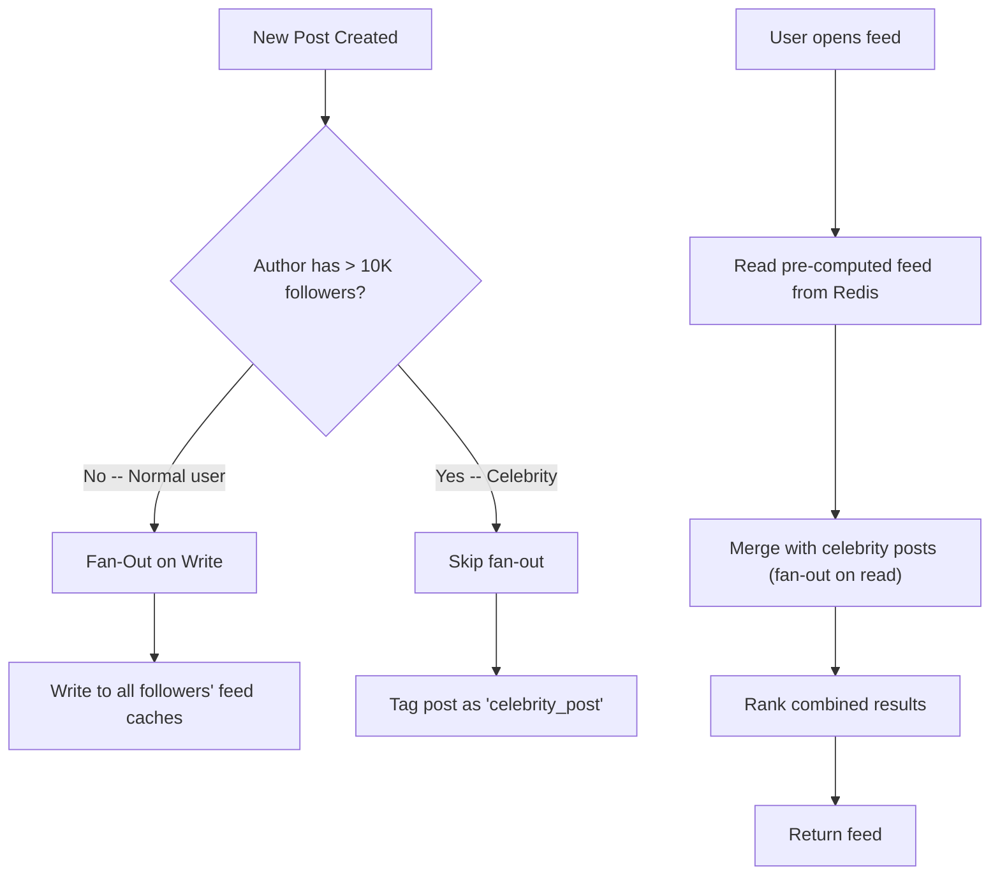

**The real answer is hybrid:** fan-out on write for normal users, fan-out on read for celebrities. This is what production systems use.

| Dimension | Fan-Out on Write | Fan-Out on Read | Hybrid |
|-----------|-----------------|----------------|--------|
| **Feed read latency** | Very fast (pre-computed) | Slow (compute on read) | Fast (mostly pre-computed) |
| **Write amplification** | Very high (N writes per post) | None | Moderate (skip celebrities) |
| **Celebrity handling** | Breaks at scale | Handles naturally | Optimized |
| **Implementation** | Moderate | Moderate | High (two code paths) |

!!! note "Industry Insight"
    **Twitter** fans out normal tweets on write to followers' timelines (Redis), mixing celebrity tweets at read time. Twitter's fan-out service processes ~300K tweets/sec fanning out to ~300B timeline deliveries/day. **Facebook** heavily favors fan-out on read with aggressive ML ranking. **Instagram** uses a hybrid similar to Twitter's.

#### Fan-Out Worker Architecture

Workers consume from Kafka, fetch the author's follower list, filter inactive users, and batch-ZADD to followers' feed caches:

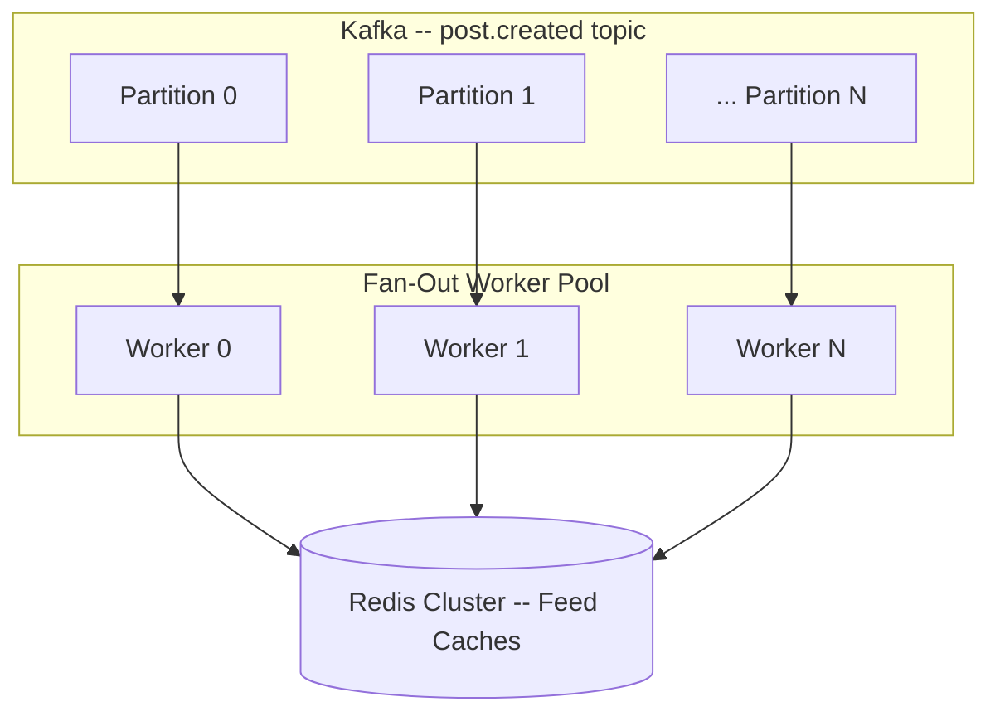

Key parameters: 100-500 Kafka partitions (allows up to 500 parallel consumers), partition key = `author_id` for ordering, batch size = 100 followers per Redis pipeline, fan-out lag target < 5 seconds.

!!! tip "Pro Tip"
    The fan-out threshold (e.g., 10K followers) is tunable. Say: *"I'd start with 10K and tune based on fan-out latency metrics and Redis write throughput. The threshold might differ by region or time of day."*

### Publishing a Post

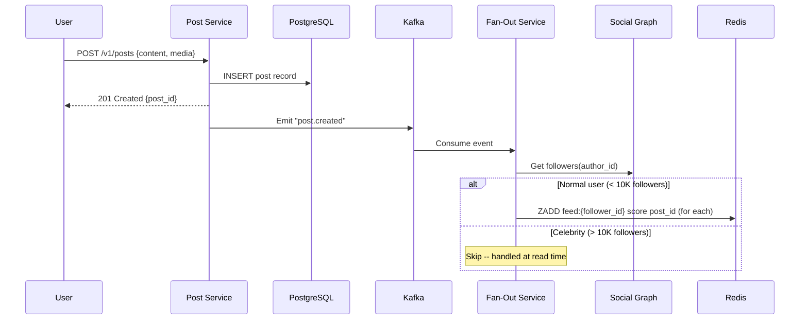

### Reading the Feed

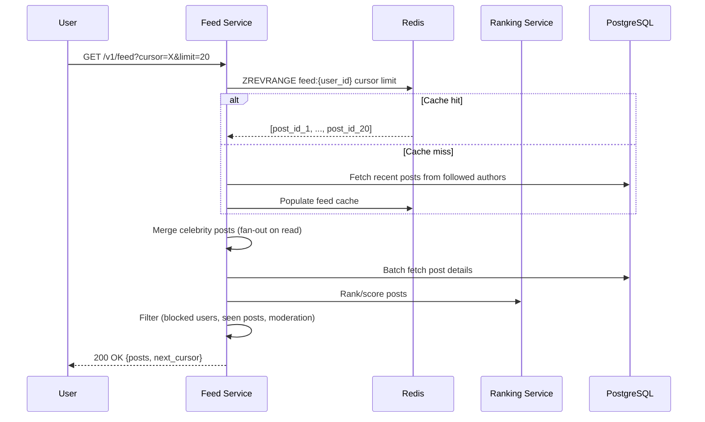

### Feed Ranking & Scoring

I'd start with chronological (simple, predictable) and layer ranking on top. Before ML, a linear scoring formula works surprisingly well:

```python
def compute_score(post, user):
    # Recency: exponential decay with half-life of 6 hours
    age_hours = (now() - post.created_at).total_seconds() / 3600
    recency_score = math.exp(-0.1155 * age_hours)

    # Engagement: log-scaled to prevent viral posts from dominating
    engagement_score = math.log1p(
        post.likes * 1.0 + post.comments * 2.0 + post.reposts * 3.0
    )

    # Relationship: user-author interaction history
    relationship_score = get_affinity(user.id, post.author_id)  # 0.0 to 1.0

    return 0.4 * recency_score + 0.3 * (engagement_score / 10.0) + 0.3 * relationship_score
```

!!! tip "Pro Tip"
    Propose this simple formula first, then say: *"In production, I'd replace this with an ML model (gradient-boosted trees or a neural ranker) trained on engagement data. But the linear formula captures the same intuitions and is easier to debug."*

The full ML ranking pipeline has four stages: candidate generation (~500 candidates from cache + celebrity posts, 50ms), scoring (feature store lookup + model inference, 100ms), re-ranking (diversity rules + ad insertion, 50ms), and filtering (blocked/muted/moderated content, 20ms).

For advanced ML ranking approaches, see [Instagram's Explore Ranking](https://engineering.fb.com/2023/08/09/ml-applications/explore-instagram-ranking/) and [YouTube's Recommendation System](https://research.google/pubs/pub45530/).

### Redis Feed Cache

Each user's feed is a Redis sorted set: key = `feed:{user_id}`, member = `post_id`, score = timestamp or ranking score.

```redis
ZADD feed:user_42 1700000000000 "post_abc123"     -- Fan-out write
ZREVRANGE feed:user_42 0 19                        -- Read top 20
ZREVRANGEBYSCORE feed:user_42 1699999999999 -inf LIMIT 0 20  -- Cursor read
ZREMRANGEBYRANK feed:user_42 0 -501                -- Trim to 500 entries
```

Keep feeds bounded: 500 entries at ~8 bytes per member = ~4 KB per user. For 500M users, that's ~2 TB -- manageable with a Redis cluster. TTL of 7 days evicts inactive users' feeds.

| Event | Invalidation Strategy |
|-------|----------------------|
| **Post deleted** | Lazy: filter at read time. Eager only for legal takedowns. |
| **User unfollowed** | Lazy: posts age out naturally. |
| **User blocked** | Filter at read time -- too expensive to eagerly remove from all caches. |

!!! warning "Edge Case"
    Filtering at read time means the feed may return fewer than the requested `limit`. Solution: over-fetch from cache (e.g., fetch 40 to return 20). If too many are filtered, fetch another batch. This is a real production concern candidates often miss.

### Social Graph (PostgreSQL)

```sql
CREATE TABLE follows (
    follower_id  VARCHAR(36) NOT NULL,
    followee_id  VARCHAR(36) NOT NULL,
    created_at   TIMESTAMPTZ DEFAULT NOW(),
    PRIMARY KEY (follower_id, followee_id)
);

CREATE INDEX idx_follows_followee ON follows(followee_id);  -- "Who follows X?" for fan-out
```

At billions of edges, use dual-write: one copy partitioned by `follower_id`, another by `followee_id`. Trades 2x storage for single-shard queries on both access patterns. Storage is cheap.

### Content Moderation

Hybrid approach: fast rule-based checks (banned words, spam patterns) pre-publish, deeper ML analysis (hate speech, nudity) post-publish with retroactive removal.

### Media Uploads (Pre-Signed URL Pattern)

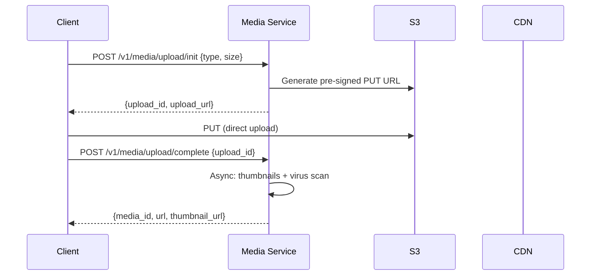

Pre-signed URLs are the industry standard -- the client uploads directly to S3, bypassing your backend. Server generates thumbnails at 150px (avatar), 600px (feed), and 1080px (full-screen).

### Scalability & Reliability

**What breaks first:** the fan-out write path for high-follower users. Everything else scales predictably (add Redis nodes, PostgreSQL replicas, Kafka partitions). The biggest cost lever is fan-out scope -- skip inactive users (no login in 30 days) to save ~30% Redis writes.

| Failure | Mitigation |
|---------|------------|
| **Fan-out worker dies** | Kafka consumer group rebalances; messages replayed from last committed offset |
| **Redis node dies** | Cluster promotes replica; cache misses trigger on-demand feed generation |
| **Redis cluster down** | Fall back to chronological feed from DB (graceful degradation) |
| **Ranking Service down** | Fall back to chronological ordering -- feed still works |
| **Full datacenter failure** | Active-passive failover via GeoDNS; data replicated via PostgreSQL streaming + Kafka MirrorMaker |

!!! tip "Pro Tip"
    Design the feed to degrade gracefully, never fail completely. If ranking is down, serve chronological. If cache is empty, generate on-demand. The feed should *never* return an error -- there's always something to show.

---

## Mobile Client Architecture

### Architecture Overview

The mobile side has fundamentally different constraints: bounded memory/CPU/battery, unreliable network, OS killing your process, and throttled background work. Despite all this, users expect instant content, full offline browsing, and buttery scrolling.

The core principle: **the local database is the UI's only data source. The network is a sync mechanism, not a dependency.** This eliminates loading spinners for cached content, survives process death, and makes offline browsing free.

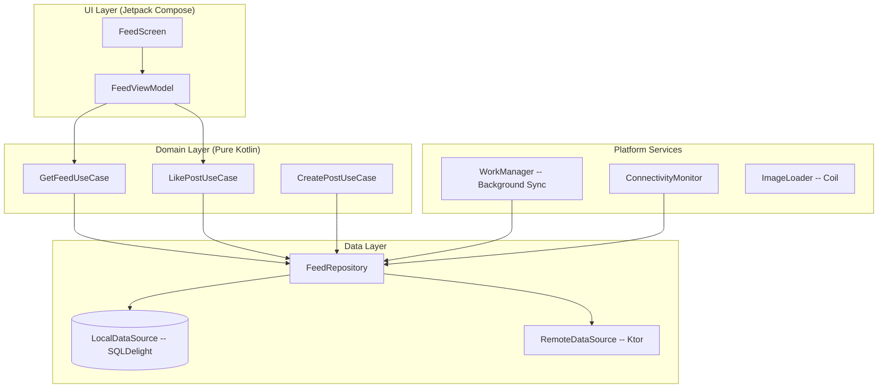

**KMP alignment:** Repository, UseCases, SQLDelight schema, and Ktor client live in `commonMain`. Only the DB driver, HTTP engine (OkHttp/Darwin), background work (WorkManager/BGTaskScheduler), image loading (Coil), and UI framework are platform-specific.

**DI choice: Koin** for KMP projects (full multiplatform support, works everywhere). For Android-only, Hilt would be the better choice for compile-time safety.

### Loading the Feed (App Open)

Local-first: show cached data instantly, then refresh in background.

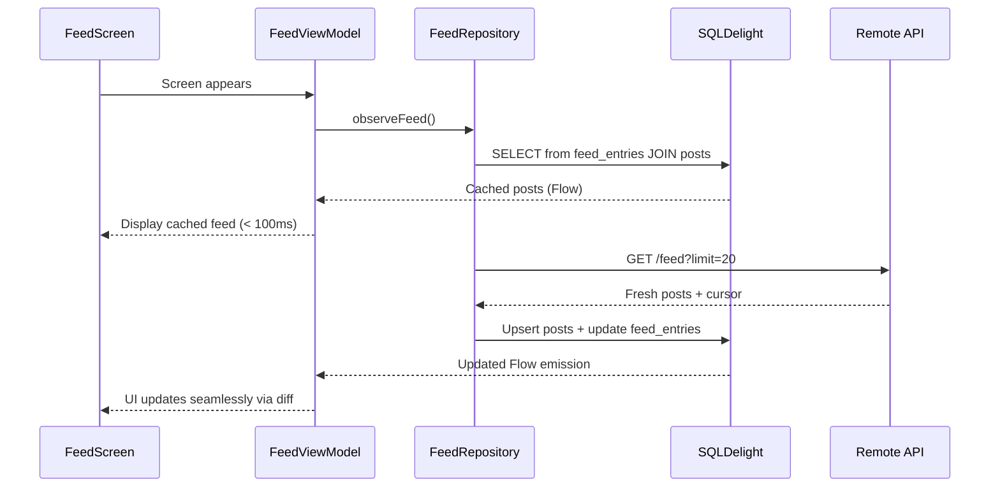

### Liking a Post (Optimistic Update)

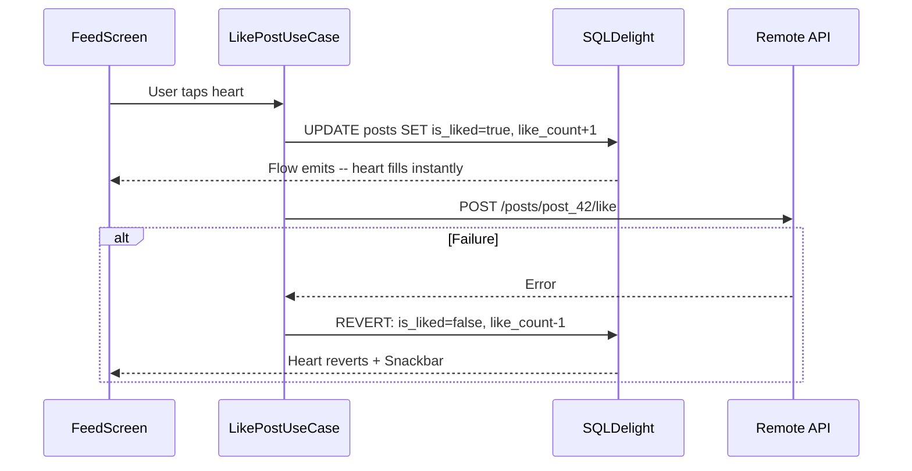

!!! tip "Pro Tip"
    Debounce like taps (500ms) before sending the API call. Rapid double-tapping should result in one API call, not two. The local state toggles instantly on each tap, but only the final state after the debounce window is sent to the server.

### Feed Caching & Local Database

I'd use **SQLDelight** over Room for KMP compatibility -- cross-platform SQL with type-safe generated Kotlin. For Android-only, Room is equally valid.

```sql
-- posts.sq
CREATE TABLE posts (
    post_id TEXT NOT NULL PRIMARY KEY,
    author_id TEXT NOT NULL,
    author_username TEXT NOT NULL,
    author_avatar_url TEXT,
    content TEXT,
    media_json TEXT,  -- JSON array of media objects
    like_count INTEGER NOT NULL DEFAULT 0,
    is_liked INTEGER NOT NULL DEFAULT 0,
    created_at INTEGER NOT NULL,
    local_id TEXT,  -- non-null for locally created posts
    status TEXT NOT NULL DEFAULT 'published'  -- published, pending, failed
);

-- feed_entries.sq (feed ordering -- separate from post data)
CREATE TABLE feed_entries (
    user_id TEXT NOT NULL,
    post_id TEXT NOT NULL,
    position REAL NOT NULL,  -- ranking score from server
    fetched_at INTEGER NOT NULL,
    PRIMARY KEY (user_id, post_id),
    FOREIGN KEY (post_id) REFERENCES posts(post_id)
);

CREATE INDEX idx_feed_position ON feed_entries(user_id, position DESC);

-- pending_actions.sq (offline action queue)
CREATE TABLE pending_actions (
    action_id TEXT NOT NULL PRIMARY KEY,
    type TEXT NOT NULL,  -- like, unlike, comment, create_post
    payload TEXT NOT NULL,
    created_at INTEGER NOT NULL,
    retry_count INTEGER NOT NULL DEFAULT 0,
    status TEXT NOT NULL DEFAULT 'pending'
);
```

Why a separate `feed_entries` table? A post exists once but can appear in multiple feeds (home, explore, profile) with different ranking positions. The feed_entries table is the feed cache -- mapping (user, post) to the server-determined position.

**Cache eviction:** max 200 entries per user, max 24h age, 50 MB total DB size cap. Evicted entries re-fetched on demand.

!!! warning "Edge Case"
    After a long offline period, the cached feed is stale. Show it immediately with a banner: "Last updated 2 days ago." On connectivity, refresh silently. Never show a blank screen while waiting for a network call -- stale content is better than no content.

### Infinite Scroll with Paging 3

On Android, **Paging 3 with RemoteMediator** provides DB-backed pagination that survives process death and integrates with offline-first:

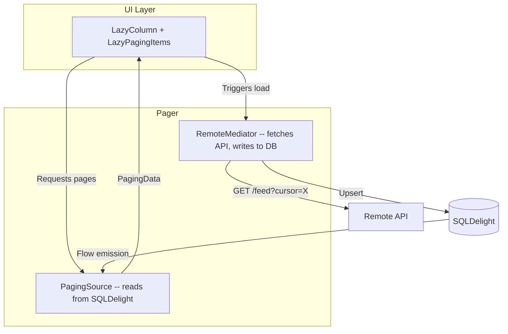

| Parameter | Value | Rationale |
|-----------|-------|-----------|
| `prefetchDistance` | 5 items | Start loading next page 5 items from end |
| `initialLoadSize` | 40 items | First page fills viewport + buffer |
| `pageSize` | 20 items | Balance payload size vs request frequency |
| `maxSize` | 200 items | Drop oldest pages from memory |

For shared KMP code, `cash-app/multiplatform-paging` provides a Paging 3-compatible API across Android and iOS.

### Image & Media Loading

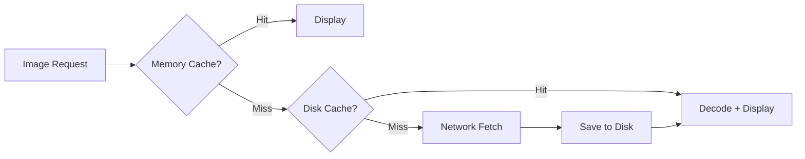

**Coil** handles this pipeline out of the box. Key config: 25% of app memory for memory cache, 250 MB disk cache. Always request the exact image size you need -- loading a 1080px image for a 150px avatar wastes bandwidth and forces a costly downscale decode. Instagram serves 7+ sizes per image for this reason.

**Blurhash placeholders:** The server includes a ~20-30 byte `blurhash` string in the post response. The client decodes it into a blurred preview in < 1ms while the real image loads -- much better UX than a blank rectangle.

**Video:** Muted autoplay when >50% visible (WiFi only by default). Pre-decode first frame as static image. Autoplay begins only after >300ms visible (debounce to prevent rapid start/stop during fast scrolling). Release ExoPlayer when video scrolls >5 items off-screen.

!!! note "Industry Insight"
    Instagram pre-decodes the first frame of videos and displays it statically. Autoplay begins only when >50% visible for >300ms. This prevents battery drain during scroll.

### Offline-First Architecture

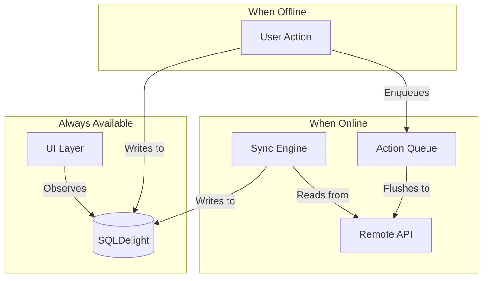

Likes, comments, and post creations performed offline are queued in `pending_actions` and flushed via **WorkManager** when connectivity returns. Conflict resolution is simple: server wins for feed content and counts; optimistic local state reverts on API failure.

**The dual-ID problem:** When a user creates a post offline, the client generates a local UUID. The server assigns the canonical ID on creation. The local DB stores both IDs and reconciles on ACK. Disable sharing until the post has a server ID.

!!! warning "Edge Case"
    `ConnectivityManager.onAvailable()` fires before the network is actually usable. Validate with a lightweight request before flushing the queue, or simply attempt the flush and handle failures gracefully.

### Feed Freshness & "New Posts" Banner

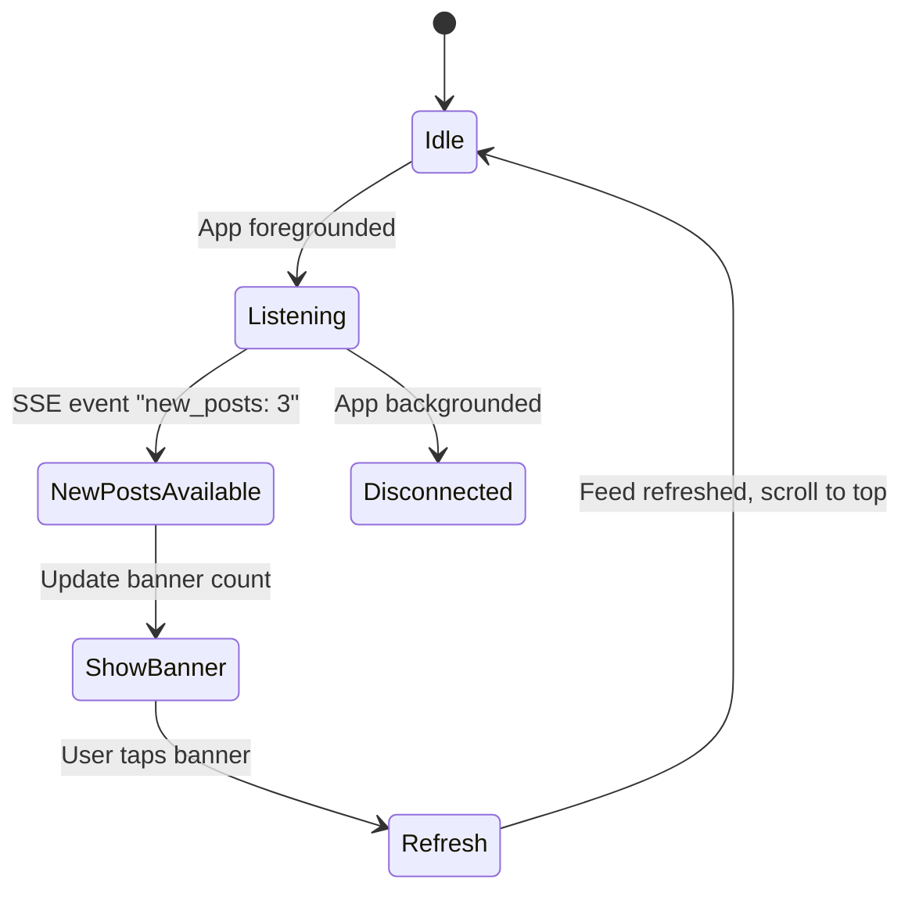

Never force-insert new content into the feed while the user is reading -- it causes jarring content shifts. Buffer new posts and show a non-intrusive "3 new posts" pill. Twitter, Instagram, and Threads all use this pattern.

Background refresh via WorkManager: periodic 30-minute sync with constraints (network connected, battery not low).

!!! tip "Pro Tip"
    Why NOT push every new post in real-time? Three reasons: (1) **Battery** -- persistent connection + processing every push drains power. (2) **Bandwidth** -- pushing full content to every follower's device is wasteful. (3) **UX** -- users read at their own pace; force-inserting content is disruptive.

### Performance Optimization

| Technique | Impact |
|-----------|--------|
| **Stable keys** | `items(posts, key = { it.postId })` prevents unnecessary recomposition |
| **Content type** | Separate types for text-only, image, video -- efficient view recycling |
| **@Immutable models** | Pre-formatted UI models (e.g., "3h ago") for Compose stability |
| **ETag / 304** | Skip unchanged feed pages, saving bandwidth |
| **Gzip** | 60-70% smaller responses (Ktor/OkHttp enable by default) |
| **Data saver mode** | Skip images, load text only on metered networks |

**Cold start target:** < 500ms from app icon tap to visible feed content. Requires: immediate DB read on ViewModel init, no splash screen delays, deferred non-critical initialization (analytics, feature flags).

!!! warning "Edge Case"
    **Scroll position restoration after process death** is tricky with Paging 3. `LazyListState` must be saved via `SavedStateHandle`, and the DB must still contain items at that position. If eviction deleted them, the user scrolls to top on restore. Mitigate by ensuring eviction only targets items well beyond the current viewport.

---

## Scalability, Reliability & Edge Cases

| Scenario | Decision | Reasoning |
|----------|----------|-----------|
| **Celebrity posts to 50M followers** | Fan-out on read (hybrid) | 50M Redis writes per post is infeasible |
| **User unfollows during active fan-out** | Let fan-out complete; filter at read time | Reversing partial fan-out is error-prone; stale entries expire |
| **Post deleted after fan-out** | Mark deleted; filter at read time | Reverse fan-out to millions of caches too expensive |
| **Viral post with millions of likes** | Redis INCR, batch flush to PostgreSQL every 5s | Direct DB UPDATE per like creates a hot row |
| **Follow/unfollow rapid toggle** | Debounce via Kafka compacted topic keyed by `follower:followee` | Only the latest state is processed |
| **New user follows 1000 accounts** | Async backfill capped at 50 recent posts per followee | Full backfill would be enormous; feed fills naturally |
| **Process death during feed scroll** | Paging state from DB; scroll position from SavedStateHandle | DB-backed paging survives process death |
| **Rate limiting on likes** | Local debounce (500ms) + server-side token bucket | Prevents rapid taps from generating multiple API calls |
| **Token expiry during scroll** | 401 triggers transparent refresh; retry original request | Ktor interceptor handles refresh; user never sees auth error |
| **Multiple feed types active** | Each feed type has its own `feed_entries` partition via `user_id` | No interference; shared `posts` table for deduplication |

!!! warning "Edge Case"
    The viral post counter problem deserves special attention. A post getting 100K likes/sec creates a hot-key bottleneck. Solution: Redis `INCR` on `likes:post_id`, batch-flush to PostgreSQL every 5s. For extreme cases, shard the counter across multiple keys (`likes:post_id:shard_0` through `likes:post_id:shard_7`) and sum on read.

---

## Wrap Up

- **Hybrid fan-out** -- push for normal users, pull for celebrities. The single hardest problem is fan-out for high-follower users; the hybrid approach solves it, but threshold tuning and graceful degradation during lag are where the real engineering complexity lives.
- **Redis sorted sets for feed cache** -- sub-ms reads, natural ordering, bounded memory. Cassandra as a persistent L2 backing store for cold feeds and compliance.
- **PostgreSQL for posts and social graph** -- write volume is manageable; relational integrity matters. Dual-indexed follows table for both fan-out and feed generation queries.
- **Offline-first mobile** -- local DB is the single source of truth for the UI. Optimistic updates with DB-level rollback. Paging 3 with RemoteMediator for DB-backed infinite scroll.
- **"New posts" banner over real-time push** -- respects battery and bandwidth; lets the user control when to see new content.

**What I'd improve with more time:** ML ranking pipeline with online learning, A/B testing framework for ranking algorithms, client-side personalization signals (dwell time, scroll speed), Compose Multiplatform for shared UI, edge-computed feed caching.

---

## References

- [How Twitter Builds Its Timeline](https://blog.twitter.com/engineering/en_us/topics/infrastructure/2017/the-infrastructure-behind-twitter-scale) -- Twitter Engineering
- [Instagram Feed Ranking](https://engineering.fb.com/2023/08/09/ml-applications/explore-instagram-ranking/) -- Meta Engineering
- [Facebook News Feed Architecture](https://engineering.fb.com/2010/03/09/core-infra/serving-facebook-multifeed-efficiency-performance-gains-through-redesign/) -- Meta Engineering
- [Designing Data-Intensive Applications](https://dataintensive.net/) -- Martin Kleppmann, Chapters 11-12
- [Paging 3 Library](https://developer.android.com/topic/libraries/architecture/paging/v3-overview) -- Android Developers
- [Offline-First Architecture](https://developer.android.com/topic/architecture/data-layer/offline-first) -- Android Developers
- [SQLDelight](https://cashapp.github.io/sqldelight/) -- CashApp
- [Multiplatform Paging](https://github.com/cashapp/multiplatform-paging) -- CashApp
- [Redis Sorted Sets](https://redis.io/docs/data-types/sorted-sets/) -- Redis.io
- [ByteByteGo: Design a News Feed System](https://bytebytego.com/courses/system-design-interview/design-a-news-feed-system) -- Alex Xu
