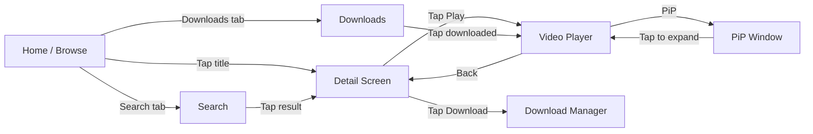
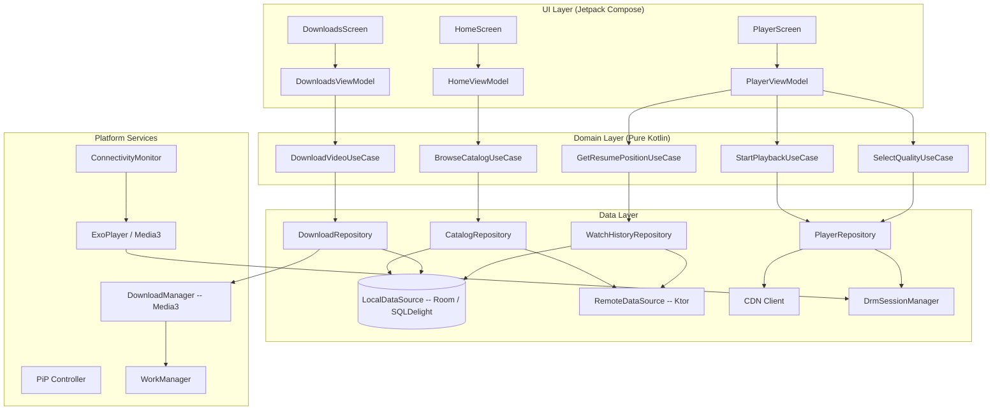
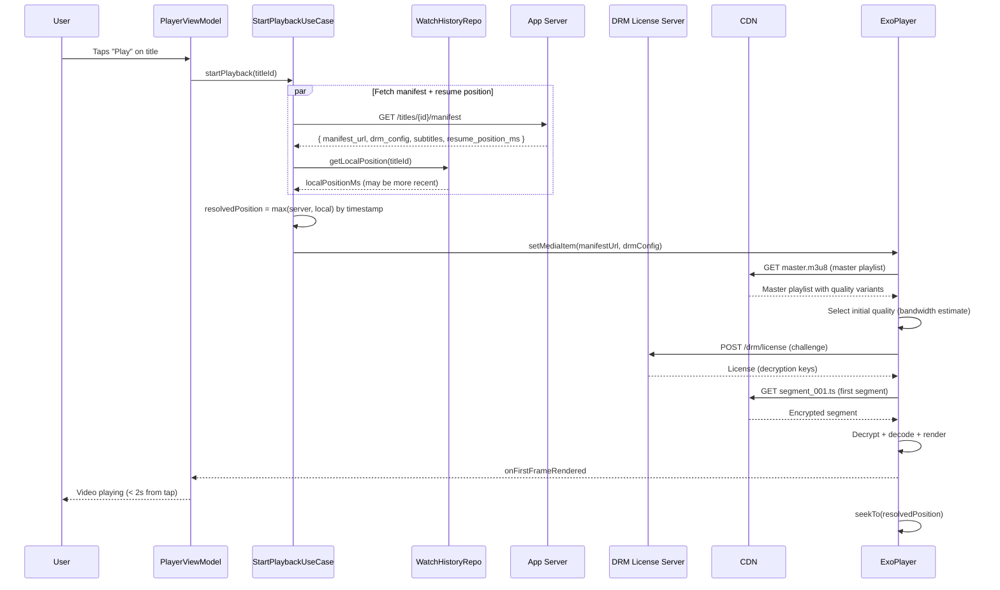
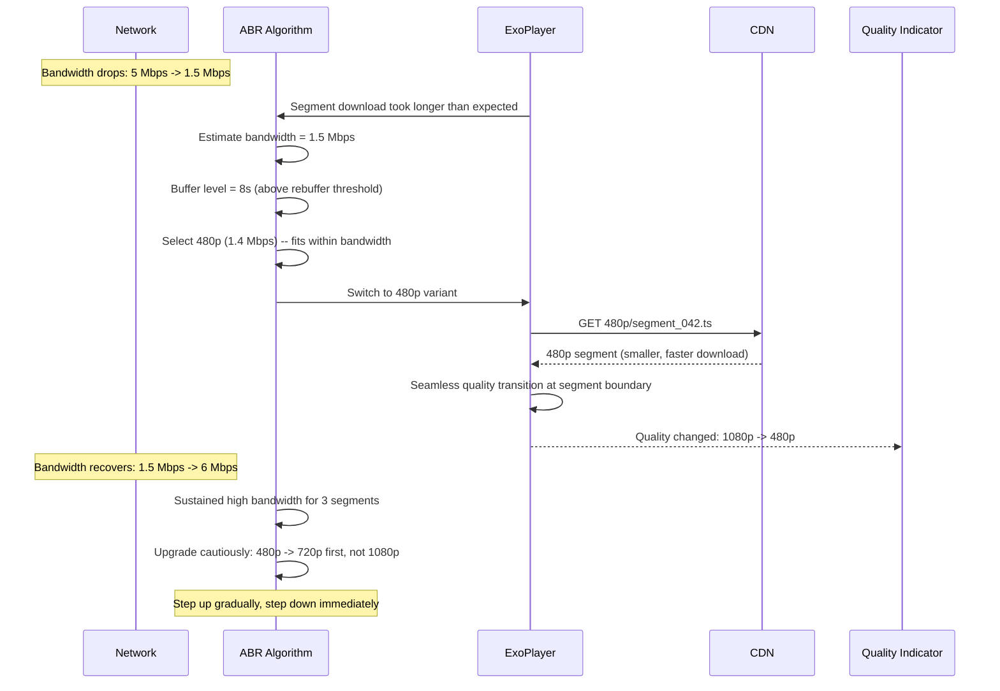
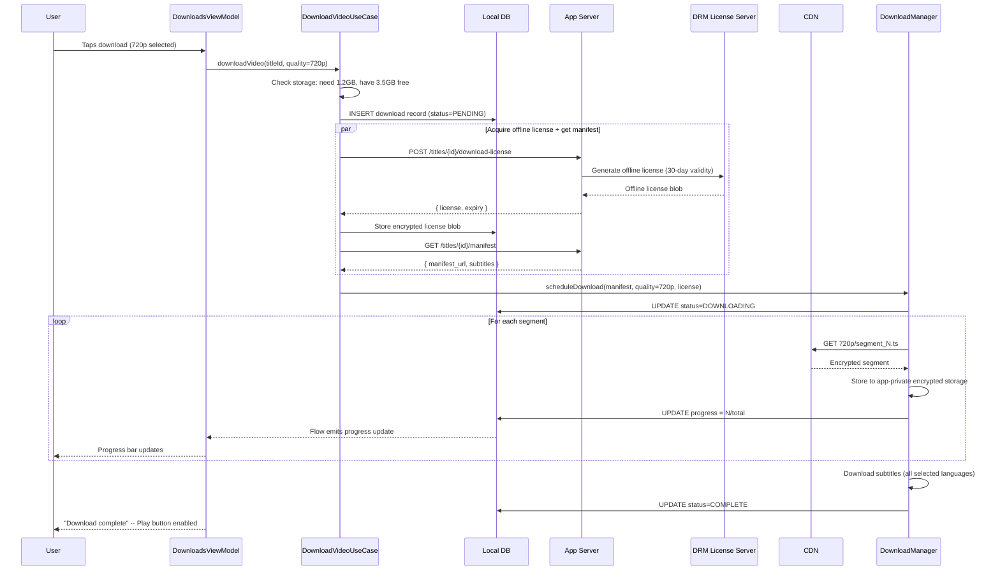
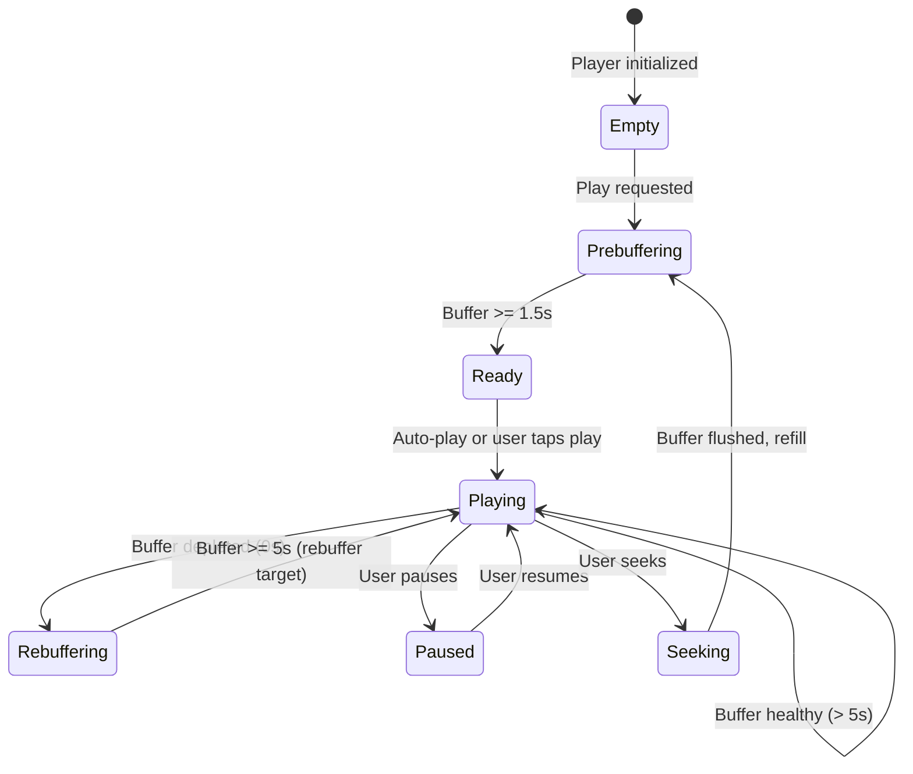
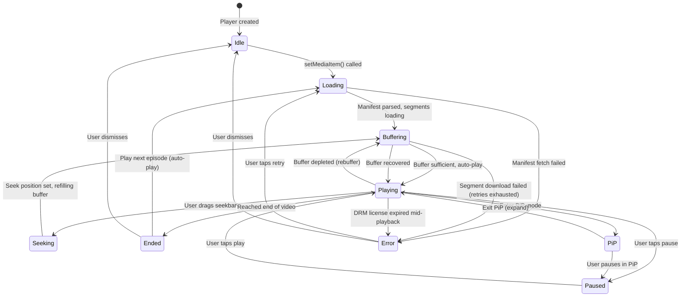

# Video Streaming

Designing a mobile video streaming app (YouTube, Netflix, Disney+) is one of the most hardware-aware system design problems you'll face. Video consumes orders of magnitude more bandwidth and battery than any other feature -- a single 1080p stream at 5 Mbps drains ~8% battery per hour. The network is volatile, DRM-protected content requires platform-specific hardware crypto, and the OS aggressively reclaims memory from video buffers. Every decision in this design is driven by those constraints.

This article covers the mobile client architecture with enough backend context to explain *why* the client is built the way it is.

!!! note "Backend Perspective"
    For server-side architecture -- CDN design, transcoding pipeline, recommendation engine, and global content delivery -- see the backend counterpart *(coming soon)*.

---

## Scoping the Problem

The first question I'd ask is whether this is on-demand only or live streaming too. Live introduces low-latency protocols (LL-HLS, WebRTC) and a fundamentally different buffer strategy -- I'd scope it out and focus on on-demand.

Next, I'd clarify the DRM level. L1 Widevine (hardware-backed, required for HD on Netflix) vs L3 (software, SD only) determines platform-specific crypto paths. And if offline downloads are supported -- which adds an entire download manager, encrypted storage, and license renewal system.

Other questions that meaningfully change the design:

- **Content types?** Short-form (TikTok/Shorts, < 60s) vs long-form (Netflix, 2h movies) drives prefetch and buffer strategies.
- **Multi-profile support?** Netflix-style profiles mean per-profile watch history, recommendations, and download quotas.
- **Simultaneous streams?** Netflix limits to 1-4 concurrent streams. Requires server-side session management and client enforcement.
- **PiP / background audio?** PiP on Android 8+ and iOS 14+ has different lifecycle implications. Background audio (screen off) requires releasing the video decoder.
- **Subtitles?** SRT only, or full WebVTT with styling, positioning, and multi-language?

**Core scope for this design:** On-demand adaptive bitrate streaming, offline downloads with DRM, resume across devices, PiP, subtitles, watch history.

**Key non-functional priorities:**

- **Time to first frame** -- < 2 seconds on broadband, < 4s on cellular. YouTube reports 1% abandonment per 100ms delay.
- **Rebuffer rate** -- < 0.5% of playback time. Even a single rebuffer causes 5.8% session abandonment (Conviva data).
- **Battery** -- < 10% per hour (screen on), < 3% per hour (audio only).
- **Process death resilience** -- resume position, download progress, and queue state must survive. Android kills background video processes aggressively.
- **Storage efficiency** -- configurable download quality with clear size estimates before download.

On the mobile side, the core tension is that video is the most resource-intensive thing a phone does, and the network it depends on is the least reliable part of the system.

---

## UI Sketch

### Key Screens

```
+-----------------------+  +-----------------------+  +-----------------------+
|    Browse / Home      |  |     Video Player      |  |      Downloads        |
|-----------------------|  |-----------------------|  |-----------------------|
| [Search]   [Profile]  |  | +-------------------+ |  | Downloads        Edit |
|                       |  | |                   | |  |-----------------------|
| Continue Watching     |  | |   VIDEO CONTENT   | |  | [thumb] Movie A      |
| [====60%] [==30%]     |  | |                   | |  |   1.2 GB  Complete    |
|                       |  | +-------------------+ |  |   [Play]              |
| Trending              |  | 00:45:22 ---|-- 2:01  |  |                       |
| [poster] [poster]     |  | [CC] [Q:1080p] [PiP] |  | [thumb] Series B E3   |
| [poster] [poster]     |  |                       |  |   850 MB  Complete    |
|                       |  | Title of the Video    |  |   [Play]              |
| Action & Adventure    |  | 2.1M views * 3d ago   |  |                       |
| [poster] [poster]     |  | [Like] [Share] [Save] |  | [thumb] Movie C       |
| [poster] [poster]     |  |                       |  |   [====75%] 640 MB    |
|                       |  | Related Videos        |  |   Downloading...      |
| [Bottom Nav: Home,    |  | [thumb] Related 1     |  |   [Pause]             |
|  Search, Downloads,   |  | [thumb] Related 2     |  |                       |
|  Profile]             |  |                       |  | Storage: 2.7/8 GB     |
+-----------------------+  +-----------------------+  +-----------------------+
```

### Navigation Flow



### Key UI States

| State | Browse Screen | Video Player | Downloads |
|-------|--------------|--------------|-----------|
| **Empty** | "Nothing to show. Check your connection." | N/A | "No downloads yet. Tap the download icon on any video." |
| **Loading** | Skeleton shimmer for poster grid | Spinner over black surface (< 2s) | Skeleton for download list |
| **Content** | Poster grid with categories, continue watching row | Video playback with controls overlay | List with progress bars and sizes |
| **Error** | Snackbar: "Failed to load catalog. Tap to retry." | Overlay: "Playback error. Tap to retry." with error code | Per-item error: "Download failed. Retry?" |
| **Offline** | Show cached catalog + "You're offline" banner | Play downloaded content only; gray out streaming titles | Full access to completed downloads |

!!! tip "Pro Tip"
    Netflix pre-caches the home screen catalog metadata and poster images aggressively. On app open, the user sees cached content instantly, and a background sync updates it silently. Never show a loading spinner for the home screen on a warm launch.

---

## API Design

### Protocol Choice: HLS Primary

I'd use **HLS** as the primary streaming protocol. It has native support on iOS (`AVPlayer`), works on Android via ExoPlayer/Media3, and is the most CDN-friendly format (standard HTTP requests for segments). Apple mandates HLS for any video app on iOS.

| Protocol | Latency | Adaptive | DRM Support | Mobile Battery |
|----------|---------|----------|-------------|----------------|
| **HLS** | Medium (segment-based) | Yes (master playlist) | FairPlay (iOS), Widevine (via CENC) | Good (HTTP-based) |
| **DASH** | Medium (segment-based) | Yes (MPD manifest) | Widevine, PlayReady | Good (HTTP-based) |
| **Progressive download** | High start, then good | No | Limited | Wasteful (downloads ahead) |
| **WebRTC** | Very low (< 500ms) | Limited | None | Poor (peer-to-peer, high CPU) |

**DASH** serves as the secondary protocol for Android where Widevine CENC integration is more natural with DASH manifests. ExoPlayer handles both seamlessly.

Why not progressive download? No ABR -- if bandwidth drops, the video stalls instead of gracefully switching quality. Why not WebRTC? Designed for video calls, not content streaming. No CDN caching, no DRM, significantly higher battery consumption. Only justified for interactive live streaming with < 1s latency.

!!! tip "Pro Tip"
    In an interview, state: "HLS for broad compatibility and CDN efficiency. The client uses ExoPlayer/Media3 on Android and AVPlayer on iOS -- both handle HLS natively. For DRM, Widevine on Android and FairPlay on iOS, both using CENC encryption." This shows you understand the protocol-platform matrix.

### Communication Channels

All non-streaming interactions use REST over HTTPS. Video segments are fetched directly from CDN -- the client never goes through the application server for segment fetches.

| Channel | Protocol | Purpose |
|---------|----------|---------|
| **Catalog / metadata** | REST (HTTPS) | Browse, search, detail, watch history |
| **Video playback** | HLS / DASH over HTTPS | Adaptive bitrate segment delivery from CDN |
| **DRM license** | REST (HTTPS) to license server | License acquisition for decryption keys |
| **Download** | HTTPS to CDN | Same segments as streaming, saved to encrypted local storage |
| **Analytics** | REST (batched) | Playback events, quality metrics |

### Key Endpoints

```
GET    /api/v1/catalog/home                              -- Personalized home feed
GET    /api/v1/catalog/search?q=term&cursor=X&limit=20   -- Search titles
GET    /api/v1/titles/{id}                               -- Full metadata
GET    /api/v1/titles/{id}/manifest                      -- HLS/DASH manifest URL + DRM config
POST   /api/v1/drm/license                               -- Acquire DRM license
POST   /api/v1/titles/{id}/download-license               -- Offline DRM license (longer validity)
POST   /api/v1/watch-history/{titleId}                   -- Update watch position
```

The manifest response is the critical handoff between backend and client:

```json
{
  "title_id": "title_abc123",
  "stream_type": "hls",
  "manifest_url": "https://cdn.example.com/titles/abc123/master.m3u8",
  "drm": {
    "scheme": "widevine",
    "license_url": "https://drm.example.com/v1/license",
    "headers": { "X-DRM-Token": "eyJhbGciOi..." }
  },
  "subtitles": [
    { "language": "en", "url": "https://cdn.example.com/.../en.vtt", "label": "English" },
    { "language": "es", "url": "https://cdn.example.com/.../es.vtt", "label": "Spanish" }
  ],
  "thumbnails": {
    "sprite_sheet_url": "https://cdn.example.com/.../sprite.jpg",
    "interval_ms": 10000
  },
  "resume_position_ms": 2722000
}
```

### Watch Position Sync

The client debounces position updates -- sends every 30 seconds during active playback, plus on pause and on exit. The server stores the latest position per title per user, using `timestamp` for last-write-wins conflict resolution across devices.

```kotlin
data class WatchPositionUpdate(
    val titleId: String,
    val positionMs: Long,
    val durationMs: Long,
    val timestamp: Long,        // Client timestamp for conflict resolution
    val deviceId: String,
    val completed: Boolean,     // True if user watched > 95% of duration
)
```

!!! warning "Edge Case"
    If the user watches on their phone to minute 45, then opens the TV app (which has a stale cache showing minute 30), the TV app must fetch the latest position before playing. Always call `GET /watch-history/{titleId}/position` immediately before playback starts. Never rely solely on cached position.

---

## Mobile Client Architecture

### Architecture Overview



The key components and why they exist:

- **StartPlaybackUseCase** -- orchestrates the critical path: fetch manifest, acquire DRM license, resolve resume position, configure player. This is the most complex use case because it coordinates three async operations before a single frame renders.
- **DrmSessionManager** -- acquires and caches DRM licenses for both streaming and offline. The hardest part to share across platforms -- license request/response format can be shared, but actual crypto is fundamentally platform-specific (Widevine uses Android's `MediaDrm`, FairPlay uses iOS's `AVContentKeySession`).
- **DownloadRepository** -- tracks download state in DB, delegates to Media3 DownloadManager. Manages encrypted storage, LRU eviction, and storage quotas.
- **WatchHistoryRepository** -- local-first with debounced server sync. Position saved to DB every 5 seconds (survives process death), synced every 30 seconds.

### KMP Alignment

| Module | Shared (commonMain) | Platform-Specific |
|--------|---------------------|-------------------|
| **Domain** | All UseCases, domain models, quality selection | Nothing -- pure Kotlin |
| **Data / Remote** | Ktor client, manifest fetcher, position sync | Platform Ktor engine (OkHttp / Darwin) |
| **Data / DRM** | License request/response models | Widevine (`MediaDrm`), FairPlay (`AVContentKeySession`) |
| **Platform / Player** | Player state machine, playback events interface | ExoPlayer/Media3 (Android), AVPlayer (iOS) |
| **Platform / Download** | Download queue logic, storage calculator | Media3 DownloadManager / `AVAssetDownloadTask` |
| **UI** | -- | Jetpack Compose / SwiftUI |

!!! tip "Pro Tip"
    DRM is the hardest part to share across platforms. Define a `DrmSessionProvider` interface in shared code, implement per platform. Netflix and Disney+ take this exact approach.

---

## Data Flows

### Playing a Video



### Adaptive Bitrate Switching



### Offline Download



---

## Design Deep Dives

### Adaptive Bitrate Streaming

The HLS master playlist declares available quality levels. The ABR algorithm in ExoPlayer/Media3 dynamically selects the best variant based on current bandwidth, buffer health, and device capability.

**Decision:** Use HLS with fMP4 containers (not MPEG-TS) to enable CENC DRM encryption that works with both Widevine and FairPlay from the same encrypted segments.

!!! note "Industry Insight"
    Netflix uses DASH with Widevine on Android and HLS with FairPlay on iOS. YouTube uses DASH on Android and HLS on iOS. Disney+ uses HLS everywhere with CMAF. The trend is converging toward HLS + fMP4 + CENC as a universal format.

**ABR algorithm configuration:**

```kotlin
val trackSelector = DefaultTrackSelector(context).apply {
    setParameters(
        buildUponParameters()
            .setMaxVideoSizeSd()  // Cap on cellular
            .setMinVideoFrameRate(24)
            .setForceLowestBitrate(false)
    )
}

val bandwidthMeter = DefaultBandwidthMeter.Builder(context)
    .setInitialBitrateEstimate(1_500_000)  // 1.5 Mbps conservative start
    .setSlidingWindowMaxWeight(2000)         // Last 2000ms of samples
    .build()
```

The three competing goals: maximize quality, minimize rebuffering, minimize quality oscillation. The key rules:

- **Step down immediately** when bandwidth drops -- don't risk rebuffering.
- **Step up gradually** -- require sustained high bandwidth for 3+ segments before upgrading.
- **Hysteresis band** -- require at least 1.5x the target bitrate before stepping up. Prevents oscillation between adjacent qualities.

!!! warning "Edge Case"
    On initial playback, the ABR algorithm has no bandwidth estimate. Netflix starts at a conservative mid-range quality (720p) and adapts within 2-3 segments. YouTube starts low and ramps up quickly. The right choice depends on your user base's typical network conditions.

### Buffer Management

| Parameter | Value | Reasoning |
|-----------|-------|-----------|
| **Min buffer** | 2.5s | Balances fast start with rebuffer protection |
| **Max buffer** | 50s | Rides out brief network drops |
| **Rebuffer target** | 5s | After rebuffer, accumulate before resuming |
| **Back buffer** | 30s | Seek backward without re-fetching |
| **Playback start** | 1.5s | Minimum to render first frame |

```kotlin
val player = ExoPlayer.Builder(context)
    .setLoadControl(
        DefaultLoadControl.Builder()
            .setBufferDurationsMs(
                /* minBufferMs = */ 15_000,
                /* maxBufferMs = */ 50_000,
                /* bufferForPlaybackMs = */ 1_500,
                /* bufferForPlaybackAfterRebufferMs = */ 5_000
            )
            .setTargetBufferBytes(50 * 1024 * 1024) // 50 MB memory cap
            .build()
    )
    .build()
```

**Buffer state machine:**



!!! tip "Pro Tip"
    Netflix dynamically adjusts buffer targets based on content type. For an action movie with high bitrate variance, they buffer more aggressively (60s). For a static interview scene, less buffer is needed. Mentioning dynamic buffer sizing shows depth in an interview.

### Offline Downloads with DRM

Downloads are fundamentally different from streaming: the client must store encrypted segments, manage DRM licenses with offline validity, track storage usage, and handle background download lifecycle.

```kotlin
val downloadManager = DownloadManager(
    context,
    DatabaseProvider(context),
    downloadCache,                     // SimpleCache with LRU eviction
    OkHttpDataSource.Factory(okHttpClient),
    Executors.newFixedThreadPool(3)    // Max 3 concurrent downloads
)
```

**Online vs offline DRM:**

| Concern | Online Streaming | Offline Download |
|---------|-----------------|------------------|
| **License validity** | Session-based (expires on close) | Persistent (30 days typical) |
| **License storage** | In-memory only | Encrypted in device keystore |
| **Renewal** | Automatic on each play | Background renewal before expiry |
| **Security level** | L1 or L3 | L1 required for HD offline (Netflix policy) |

The offline license manager acquires a persistent license, stores it encrypted, and schedules proactive renewal via WorkManager 2 days before expiry:

```kotlin
class OfflineLicenseManager(
    private val drmSessionManager: DefaultDrmSessionManager,
    private val licenseDao: LicenseDao,
    private val workManager: WorkManager
) {
    suspend fun acquireOfflineLicense(titleId: String, drmConfig: DrmConfig): ByteArray {
        val keyRequest = drmSessionManager.getKeyRequest(/* ... */)
        val license = licenseApi.fetchLicense(keyRequest, offline = true)

        licenseDao.insertLicense(
            LicenseEntity(
                titleId = titleId,
                licenseBlob = license,
                expiresAt = System.currentTimeMillis() + 30.days.inWholeMilliseconds,
                acquiredAt = System.currentTimeMillis()
            )
        )

        // Schedule renewal 2 days before expiry
        val request = OneTimeWorkRequestBuilder<LicenseRenewalWorker>()
            .setInitialDelay(28.days.inWholeMilliseconds, TimeUnit.MILLISECONDS)
            .setConstraints(Constraints.Builder()
                .setRequiredNetworkType(NetworkType.CONNECTED).build())
            .setInputData(workDataOf("title_id" to titleId))
            .build()
        workManager.enqueueUniqueWork("license_renewal_$titleId", REPLACE, request)

        return license
    }
}
```

**Storage management** needs two capabilities: pre-flight space checks and auto-eviction of watched content.

```kotlin
class StorageManager(private val downloadDao: DownloadDao, private val context: Context) {
    suspend fun ensureSpace(requiredBytes: Long): Boolean {
        if (context.filesDir.usableSpace >= requiredBytes) return true

        // Auto-evict watched downloads (completed viewing, oldest first)
        val watched = downloadDao.getWatchedDownloads(orderBy = "completed_at ASC")
        for (download in watched) {
            deleteDownload(download.titleId)
            if (context.filesDir.usableSpace >= requiredBytes) return true
        }
        return false
    }
}
```

!!! warning "Edge Case"
    Netflix shows estimated download size before the user taps download: "720p -- approximately 1.2 GB." If the device doesn't have enough space, disable the download button: "Not enough storage. Free up X MB or choose a lower quality." Never start a download that will fail due to storage.

### Picture-in-Picture

```kotlin
class PlayerActivity : AppCompatActivity() {

    override fun onUserLeaveHint() {
        if (playerViewModel.isPlaying.value) enterPipMode()
    }

    private fun enterPipMode() {
        val params = PictureInPictureParams.Builder()
            .setAspectRatio(Rational(16, 9))
            .setActions(listOf(
                buildAction(R.drawable.ic_rewind_10, "Rewind 10s", ACTION_PIP_REWIND),
                buildAction(
                    if (playerViewModel.isPlaying.value) R.drawable.ic_pause else R.drawable.ic_play,
                    "Toggle", ACTION_PIP_TOGGLE
                ),
                buildAction(R.drawable.ic_forward_10, "Forward 10s", ACTION_PIP_FORWARD),
            ))
            .setAutoEnterEnabled(true) // Android 12+: seamless PiP on swipe home
            .build()
        enterPictureInPictureMode(params)
    }

    override fun onPictureInPictureModeChanged(isInPiP: Boolean, newConfig: Configuration) {
        if (isInPiP) playerViewModel.onEnterPip()
        else playerViewModel.onExitPip()
    }
}
```

Key PiP decisions:

- **Auto-enter on Android 12+** using `setAutoEnterEnabled(true)` -- seamless UX when user swipes home. On older versions, fall back to `onUserLeaveHint()`. YouTube and Netflix both use this.
- **Keep same ExoPlayer instance** -- PiP is a window mode change, not a lifecycle destroy. Don't release and recreate the player.
- **Cap quality at 480p** in PiP -- the window is small; 1080p wastes bandwidth and battery.
- **Disable subtitles in PiP** -- the window is too small for readable text.

### Player State Machine



```kotlin
sealed interface PlayerState {
    data object Idle : PlayerState
    data object Loading : PlayerState
    data class Buffering(val progress: Float) : PlayerState
    data class Playing(
        val positionMs: Long, val durationMs: Long,
        val quality: Quality, val isInPip: Boolean,
    ) : PlayerState
    data class Paused(val positionMs: Long, val durationMs: Long) : PlayerState
    data class Seeking(val targetMs: Long) : PlayerState
    data object Ended : PlayerState
    data class Error(val code: PlayerErrorCode, val message: String, val isRetryable: Boolean) : PlayerState
}

enum class PlayerErrorCode {
    NETWORK_ERROR, DRM_LICENSE_EXPIRED, DRM_DEVICE_REVOKED,
    MANIFEST_PARSE_ERROR, DECODER_ERROR, CONTENT_NOT_AVAILABLE,
    CONCURRENT_STREAM_LIMIT,
}
```

### Prefetching and Preloading

| Context | What to Prefetch | How Much |
|---------|-----------------|----------|
| **Browse feed** | Poster art for visible + 1 screen ahead | ~20 images |
| **Detail screen** | HLS manifest + first 2 segments | ~5 MB |
| **During playback** | Manifest + first 3 segments of next episode | ~8 MB |
| **Continue Watching** | Watch position + poster for top 10 titles | Metadata only |

```kotlin
class PrefetchManager(private val player: ExoPlayer) {
    fun prefetchNextEpisode(nextManifestUrl: String) {
        val preloadMediaSource = HlsMediaSource.Factory(dataSourceFactory)
            .createMediaSource(MediaItem.fromUri(nextManifestUrl))
        // Media3 preloading -- loads manifest + initial segments
        player.addMediaSource(preloadMediaSource)
        // Player seamlessly transitions when current item ends
    }
}
```

!!! note "Industry Insight"
    YouTube prefetches the first few seconds of the next recommended video while the current one is playing. Netflix preloads the next episode's manifest at 90% completion. This enables "instant" playback for the next item -- the user never sees a loading spinner between episodes.

### Thumbnail Preview on Seek

When the user scrubs the seek bar, sprite sheets provide frame thumbnails. One HTTP request downloads all thumbnails for a video. The client calculates the grid position from the seek time.

```kotlin
class ThumbnailProvider(
    private val spriteSheetUrl: String,
    private val intervalMs: Long,     // e.g., 10_000 (every 10s)
    private val columns: Int,         // e.g., 10 per row
    private val thumbWidth: Int,
    private val thumbHeight: Int,
) {
    private var spriteSheet: Bitmap? = null

    fun getThumbnail(positionMs: Long): Bitmap? {
        val sheet = spriteSheet ?: return null
        val index = (positionMs / intervalMs).toInt()
        val x = (index % columns) * thumbWidth
        val y = (index / columns) * thumbHeight
        return Bitmap.createBitmap(sheet, x, y, thumbWidth, thumbHeight)
    }
}
```

### Watch History and Resume Sync

Local-first with background sync. Position saved locally on every progress update (every 5 seconds), synced to server in debounced batches (every 30 seconds).

```kotlin
class WatchHistoryRepository(
    private val watchHistoryDao: WatchHistoryDao,
    private val api: WatchHistoryApi,
    private val scope: CoroutineScope,
) {
    private val syncBuffer = MutableSharedFlow<WatchPositionUpdate>(
        extraBufferCapacity = 10, onBufferOverflow = BufferOverflow.DROP_OLDEST
    )

    init {
        scope.launch {
            syncBuffer.debounce(30_000).collect { update ->
                try { api.updatePosition(update) }
                catch (_: IOException) { /* Local DB is truth, retries on next debounce */ }
            }
        }
    }

    suspend fun updatePosition(titleId: String, positionMs: Long, durationMs: Long) {
        val update = WatchPositionUpdate(
            titleId = titleId, positionMs = positionMs, durationMs = durationMs,
            timestamp = System.currentTimeMillis(),
            deviceId = deviceIdProvider.getDeviceId(),
            completed = positionMs.toFloat() / durationMs > 0.95f
        )
        watchHistoryDao.upsert(update.toEntity()) // Local first -- survives process death
        syncBuffer.emit(update)                    // Queue for server sync
    }

    suspend fun getResumePosition(titleId: String): Long {
        val local = watchHistoryDao.getPosition(titleId)
        return try {
            val remote = api.getPosition(titleId)
            if (remote.timestamp > (local?.timestamp ?: 0)) {
                watchHistoryDao.upsert(remote.toEntity())
                remote.positionMs
            } else local?.positionMs ?: 0L
        } catch (_: IOException) { local?.positionMs ?: 0L }
    }
}
```

**"Continue Watching" row logic:** Show titles where position > 30s (skip accidental taps) and < 95% complete, sorted by most recently watched, capped at 20 items.

### Battery and Data Optimization

| Strategy | Implementation | Impact |
|----------|---------------|--------|
| **Cellular quality cap** | Default max 480p on cellular; user can override | ~70% bandwidth reduction vs 1080p |
| **WiFi-only downloads** | Downloads paused on cellular by default | Prevents accidental multi-GB usage |
| **Background audio mode** | Release video decoder, keep audio only | ~60% battery savings |
| **Decoder selection** | Prefer hardware decoder over software | ~40% less CPU usage |
| **Batch analytics** | Queue events, send every 60s or on pause | Fewer radio wake-ups |
| **Buffer cap on cellular** | Max 30s buffer (vs 50s on WiFi) | Less speculative data usage |

```kotlin
class NetworkAwareQualityPolicy(
    private val connectivityMonitor: ConnectivityMonitor,
    private val settingsRepository: SettingsRepository,
) {
    fun getMaxResolution(): Resolution {
        val userOverride = settingsRepository.getCellularQualityCap()
        if (userOverride != null) return userOverride

        return when (connectivityMonitor.currentNetworkType()) {
            NetworkType.WIFI -> Resolution.UNLIMITED
            NetworkType.CELLULAR_5G -> Resolution.HD_1080P
            NetworkType.CELLULAR_LTE -> Resolution.SD_480P
            NetworkType.CELLULAR_3G -> Resolution.SD_360P
            NetworkType.NONE -> Resolution.OFFLINE_ONLY
        }
    }
}
```

!!! warning "Edge Case"
    Users on unlimited data plans are frustrated by automatic cellular quality caps. Always provide a "Use full quality on cellular" toggle in settings. Netflix and YouTube both offer this. But default to conservative -- most users won't change the setting, and a surprise 2GB data bill causes app uninstalls.

---

## Scalability, Reliability & Edge Cases

| Scenario | Decision | Reasoning |
|----------|----------|-----------|
| **Network drops mid-stream** | Continue from buffer; degrade quality; rebuffer only when empty | A 30s buffer buys time for recovery. Show a subtle quality indicator, not an error. |
| **DRM license expires during offline playback** | Allow current session to finish; block next play until renewed online | Interrupting active playback is hostile UX. Netflix does exactly this. |
| **Storage full during download** | Pause download, prompt: "Free X MB or choose lower quality." Offer to delete watched downloads. | Never fail silently. Pre-check storage but handle runtime exhaustion too. |
| **User seeks beyond buffer** | Flush buffer, request from seek position, show brief spinner | Don't fast-download the gap -- wasteful. YouTube and Netflix both show a brief spinner on far seeks. |
| **Concurrent stream limit exceeded** | Server returns 403. Show: "You're watching on another device." Offer "Stop other streams" button. | Server is the authority. Client should never enforce this locally -- it can be bypassed. |
| **App killed during PiP** | Player state persisted to DB on every progress update. On relaunch, offer "Resume?" | PiP runs in the Activity's process. When killed, everything is lost unless persisted. |
| **Low memory during 4K playback** | On `TRIM_MEMORY_RUNNING_LOW`, reduce buffer size and drop to 720p | Graceful degradation is better than an OOM crash. |
| **Slow storage (cheap eMMC)** | Detect write speed on first download. If < 10 MB/s, cap download quality at 720p. | 4K at 12 Mbps to a device writing at 8 MB/s causes download buffer overflow and failures. |
| **Audio language switch mid-stream** | Use `trackSelectionParameters` to switch; accept brief rebuffer if new segments needed | ExoPlayer supports mid-stream track switching without rebuffering if tracks share the same timeline. |
| **Subtitle/audio sync drift** | Expose offset setting (+/- 5s in 100ms increments) | VLC-style offset prevents support tickets for user-uploaded content. |

---

## Wrap Up

- **HLS + fMP4 + CENC as the universal streaming format.** Single encoding pipeline serves both iOS (FairPlay) and Android (Widevine). CDN caching is maximally efficient with standard HTTP segment delivery.
- **Adaptive bitrate with conservative defaults.** Start mid-range, step down immediately, step up gradually. Buffer 30-50 seconds. Cap quality on cellular by default.
- **Media3 as the player and download engine.** ABR, DRM, subtitles, PiP, and offline downloads in a single integrated stack.
- **Local-first watch history with debounced sync.** Position saved to local DB every 5 seconds, synced every 30 seconds. Last-write-wins for cross-device conflict resolution.
- **Player state machine as the architectural backbone.** Every UI element, analytics event, and background behavior derives from explicit, testable state transitions.

**What I'd improve with more time:** Live streaming with low latency (LL-HLS), Chromecast/AirPlay integration, ML-based content preloading, parental controls and profiles, accessibility (audio description tracks, voice control), playback speed control.

---

## References

- [Media3 ExoPlayer Documentation -- Android Developers](https://developer.android.com/media/media3/exoplayer) -- adaptive playback, DRM, downloads, track selection
- [HLS Authoring Specification -- Apple](https://developer.apple.com/documentation/http-live-streaming/hls-authoring-specification-for-apple-devices) -- segment duration, codec support, fMP4 requirements
- [Widevine DRM -- Google](https://www.widevine.com/solutions/widevine-drm) -- L1/L3 security levels, offline license management
- [Netflix Tech Blog -- Adaptive Streaming](https://netflixtechblog.com/) -- ABR algorithms, buffer management, encoding optimization
- [Conviva State of Streaming Report](https://www.conviva.com/state-of-streaming/) -- rebuffer rates, start times, quality metrics
- [Picture-in-Picture -- Android Developers](https://developer.android.com/develop/ui/views/picture-in-picture) -- PiP lifecycle, remote actions, Android 12+ auto-enter
- [AVFoundation -- Apple Developer](https://developer.apple.com/av-foundation/) -- iOS video playback, FairPlay DRM, offline HLS downloads
