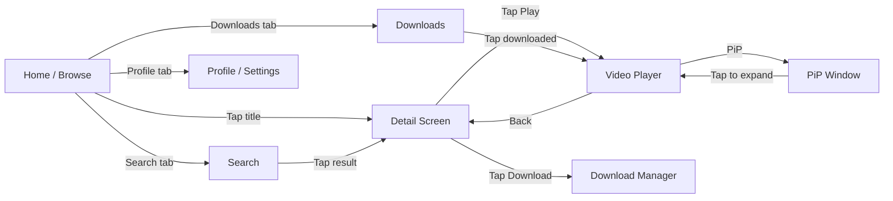
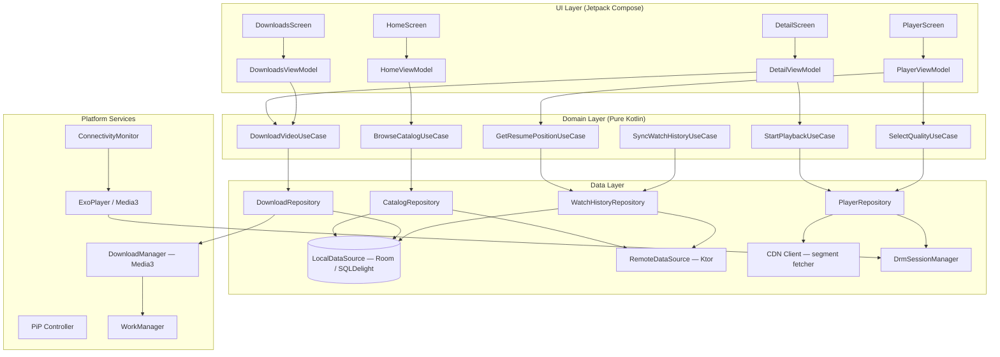
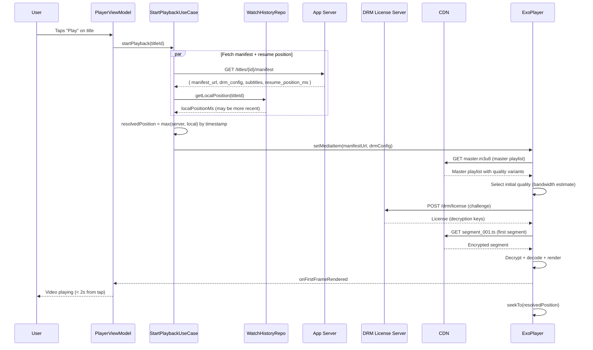
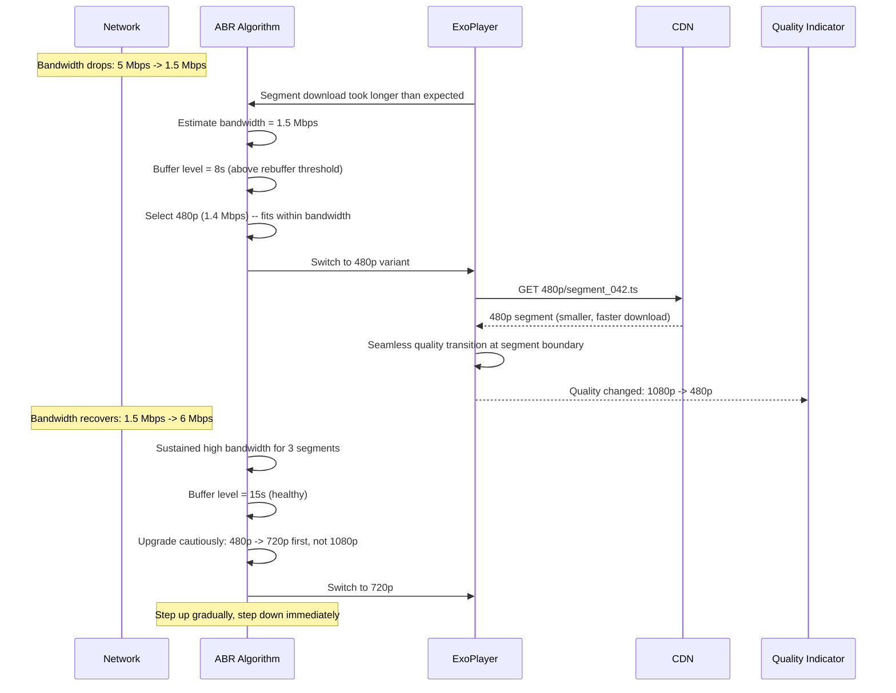
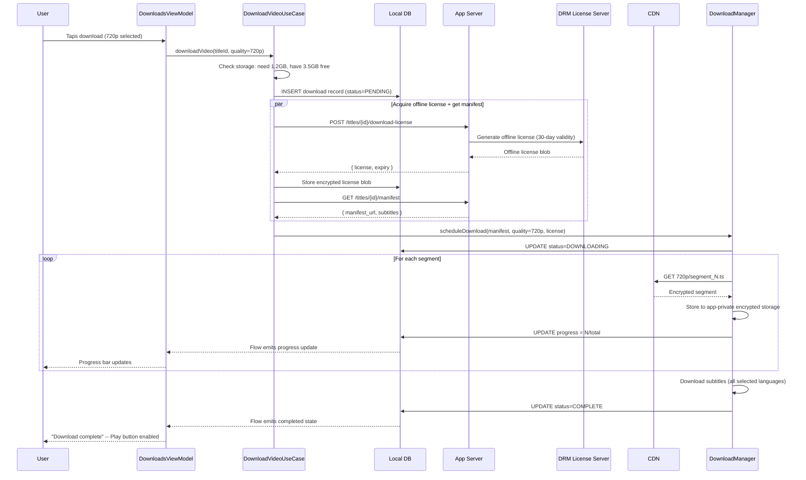
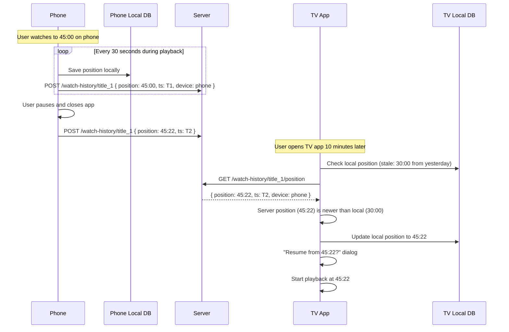
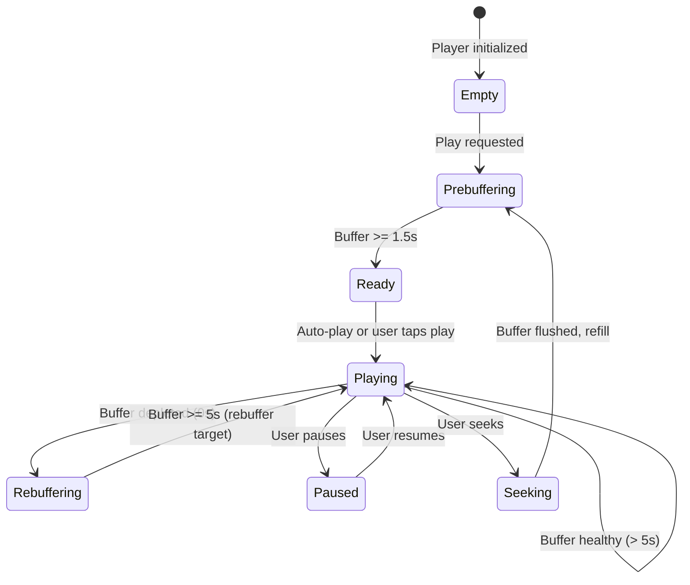
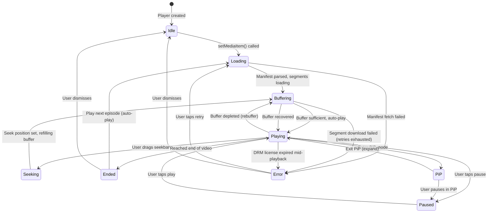

# Video Streaming App -- Mobile Client Architecture

This document covers the **client-side** design of a mobile video streaming application (YouTube / Netflix / Disney+). The focus is on architecture decisions unique to streaming on a resource-constrained device: adaptive bitrate playback, buffer management, offline downloads with DRM, picture-in-picture, and battery-conscious media consumption. The target reader is a senior Android or KMP engineer preparing for a system design interview.

!!! note "Backend Perspective"
    For server-side architecture -- CDN design, transcoding pipeline, recommendation engine, and global content delivery -- see the backend counterpart *(coming soon)*.

**Why mobile video streaming is its own design problem:**

- Video consumes orders of magnitude more bandwidth and battery than any other feature. A single 1080p stream at 5 Mbps drains ~8% battery per hour.
- The network is volatile: bandwidth fluctuates wildly between WiFi, 5G, LTE, and tunnels. The player must adapt in real-time without the user noticing.
- DRM-protected content requires hardware-backed decryption that differs fundamentally between Android (Widevine) and iOS (FairPlay).
- The OS aggressively reclaims memory from video buffers. Process death during background playback must not lose the user's position.
- Users expect instant playback start (< 2 seconds), zero rebuffering, and seamless transitions between streaming and downloaded content.

Every design decision in this document is driven by those constraints.

---

## Problem & Design Scope

### Clarifying Questions

Before drawing a single box, ask the interviewer these questions to bound the problem:

1. **On-demand only or live streaming too?** Live introduces low-latency protocols (LL-HLS, WebRTC) and a fundamentally different buffer strategy.
2. **What DRM level is required?** L1 Widevine (hardware-backed, required for HD on Netflix) vs L3 (software, SD only). Determines platform-specific crypto.
3. **Offline downloads supported?** If yes, adds an entire download manager, encrypted storage, license renewal, and storage quota management.
4. **Content types?** Short-form (TikTok/YouTube Shorts, < 60s) vs long-form (Netflix, 2h movies) drives prefetch and buffer strategies.
5. **Multi-profile support?** Netflix-style profiles mean per-profile watch history, recommendations, and download quotas.
6. **Simultaneous streams?** Netflix limits to 1-4 concurrent streams per account. Requires server-side session management and client enforcement.
7. **Target platforms?** Android + iOS (KMP shared logic)? Smart TVs? Determines how much player code is shared.
8. **Picture-in-Picture required?** PiP on Android 8+ and iOS 14+ has different lifecycle implications.
9. **Background audio playback?** Podcasts, music videos, or commentary tracks playing with screen off.
10. **Subtitle/caption support level?** SRT only, or full WebVTT with styling, positioning, and multi-language?

### Functional Requirements

| Requirement | Details |
|-------------|---------|
| **Browse catalog** | Grid/list of titles with poster art, categories, search, continue watching |
| **Play video** | Adaptive bitrate streaming with quality selection |
| **Offline download** | Download videos for offline viewing with DRM protection |
| **Resume playback** | Resume from exact position across devices |
| **Picture-in-Picture** | Continue watching while browsing other apps |
| **Subtitles/captions** | Multi-language captions with style customization |
| **Watch history** | Track viewing progress, "Continue Watching" row |
| **Quality settings** | Manual quality selection + auto mode, cellular data caps |

### Non-Functional Requirements

| Requirement | Target | Why It Matters |
|-------------|--------|----------------|
| **Time to first frame** | < 2 seconds on broadband, < 4s on cellular | Users abandon videos with slow starts -- YouTube reports 1% abandonment per 100ms delay |
| **Rebuffer rate** | < 0.5% of playback time | Even a single rebuffer causes 5.8% session abandonment (Conviva data) |
| **Offline playback** | Full video + subtitles + metadata | Users download for flights; "no internet" must never block downloaded content |
| **Battery during playback** | < 10% per hour (screen on), < 3% per hour (audio only) | Video is already battery-heavy; the app must not add unnecessary overhead |
| **Smooth UI** | 60 fps in browse, no dropped frames in player controls | Video apps are visual-first; jank is immediately noticeable |
| **Storage efficiency** | Configurable download quality; clear size estimate before download | Users on 64GB devices care deeply about storage |
| **Process death resilience** | Resume position, download progress, and queue state survive | Android kills background video processes aggressively during memory pressure |

### Mobile vs Backend Constraints

| Concern | Backend Focus | Mobile Focus |
|---------|--------------|--------------|
| **Networking** | CDN edge nodes, origin shields, cache invalidation | Adaptive bitrate, WiFi-to-cellular handoff, bandwidth estimation |
| **Storage** | S3, transcoded variants, CDN cache | Encrypted offline files, LRU eviction, storage quota |
| **Compute** | Transcoding farm, DRM license server | Hardware video decode, DRM module (Widevine/FairPlay) |
| **State** | Session management, concurrent stream limits | Player state machine, process death, PiP lifecycle |
| **Scaling** | Global CDN, regional replicas | Single device, bounded decode capability |
| **DRM** | License server, key rotation, content encryption | Hardware security module, license caching, offline license renewal |

---

## UI Sketch

### Key Screens

```
+-----------------------+  +-----------------------+  +-----------------------+
|    Browse / Home      |  |     Video Player      |  |      Downloads        |
|-----------------------|  |-----------------------|  |-----------------------|
| [Search]   [Profile]  |  | +-------------------+ |  | Downloads        Edit |
|                       |  | |                   | |  |-----------------------|
| Continue Watching     |  | |   VIDEO CONTENT   | |  | [thumb] Movie A      |
| [====60%] [==30%]     |  | |                   | |  |   1.2 GB  Complete    |
|                       |  | +-------------------+ |  |   [Play]              |
| Trending              |  | 00:45:22 ---|-- 2:01  |  |                       |
| [poster] [poster]     |  | [CC] [Q:1080p] [PiP] |  | [thumb] Series B E3   |
| [poster] [poster]     |  |                       |  |   850 MB  Complete    |
|                       |  | Title of the Video    |  |   [Play]              |
| Action & Adventure    |  | 2.1M views * 3d ago   |  |                       |
| [poster] [poster]     |  | [Like] [Share] [Save] |  | [thumb] Movie C       |
| [poster] [poster]     |  |                       |  |   [====75%] 640 MB    |
|                       |  | Related Videos        |  |   Downloading...      |
| [Bottom Nav: Home,    |  | [thumb] Related 1     |  |   [Pause]             |
|  Search, Downloads,   |  | [thumb] Related 2     |  |                       |
|  Profile]             |  |                       |  | Storage: 2.7/8 GB     |
+-----------------------+  +-----------------------+  +-----------------------+

+-----------------------+
|   Picture-in-Picture  |
|-----------------------|
|                       |
|   (User's other app)  |
|                       |
|   +----------+        |
|   | PiP      |        |
|   | Window   |        |
|   | [>>][||] |        |
|   +----------+        |
|                       |
+-----------------------+
```

### Navigation Flow



### Key UI States

| State | Browse Screen | Video Player | Downloads |
|-------|--------------|--------------|-----------|
| **Empty** | "Nothing to show. Check your connection." | N/A | "No downloads yet. Tap the download icon on any video." |
| **Loading** | Skeleton shimmer for poster grid | Spinner over black surface (< 2s) | Skeleton for download list |
| **Content** | Poster grid with categories, continue watching row | Video playback with controls overlay | List with progress bars and sizes |
| **Error** | Snackbar: "Failed to load catalog. Tap to retry." | Overlay: "Playback error. Tap to retry." with error code | Per-item error: "Download failed. Retry?" |
| **Offline** | Show cached catalog + "You're offline" banner | Play downloaded content only; gray out streaming titles | Full access to completed downloads |

!!! tip "Pro Tip"
    Netflix pre-caches the home screen catalog metadata and poster images aggressively. On app open, the user sees cached content instantly, and a background sync updates it silently. Never show a loading spinner for the home screen on a warm launch.

---

## API Design

### Protocol Comparison for Video Streaming

| Protocol | Use Case | Latency | Adaptive | DRM Support | Mobile Battery |
|----------|----------|---------|----------|-------------|----------------|
| **HLS (HTTP Live Streaming)** | On-demand + live | Medium (segment-based) | Yes (master playlist) | FairPlay (iOS), Widevine (via CENC) | Good (HTTP-based, CDN-friendly) |
| **DASH (Dynamic Adaptive Streaming)** | On-demand + live | Medium (segment-based) | Yes (MPD manifest) | Widevine, PlayReady | Good (HTTP-based) |
| **Progressive download** | Simple playback | High start, then good | No | Limited | Good but wasteful (downloads ahead) |
| **WebRTC** | Ultra-low latency live | Very low (< 500ms) | Limited | None (custom needed) | Poor (peer-to-peer, high CPU) |

### Decision: HLS Primary + DASH Fallback

**HLS** is the primary streaming protocol. It has native support on iOS (`AVPlayer`), works on Android via ExoPlayer/Media3, and is the most CDN-friendly format (standard HTTP requests for segments). Apple mandates HLS for any video app on iOS.

**DASH** serves as the secondary protocol for Android where Widevine CENC integration is more natural with DASH manifests. ExoPlayer handles both seamlessly.

**Why not progressive download?** No adaptive bitrate support. If the user's bandwidth drops, the video stalls instead of gracefully switching to a lower quality. Unacceptable for any serious streaming app.

**Why not WebRTC?** Designed for real-time communication (video calls), not content streaming. No CDN caching, no DRM, and significantly higher battery consumption. Only justified for interactive live streaming (Twitch-style with < 1s latency).

!!! tip "Pro Tip"
    In an interview, state: "HLS for broad compatibility and CDN efficiency. The client uses ExoPlayer/Media3 on Android and AVPlayer on iOS -- both handle HLS natively. For DRM, Widevine on Android and FairPlay on iOS, both using CENC encryption." This shows you understand the protocol-platform matrix.

### REST API for Catalog + Metadata

All non-streaming interactions use REST over HTTPS. The video segments themselves are fetched directly from CDN via standard HTTP GET requests -- the client never goes through the application server for segment fetches.

| Channel | Protocol | Purpose |
|---------|----------|---------|
| **Catalog / metadata** | REST (HTTPS) | Browse, search, detail, watch history, user preferences |
| **Video playback** | HLS / DASH over HTTPS | Adaptive bitrate segment delivery from CDN |
| **DRM license** | REST (HTTPS) to license server | License acquisition for decryption keys |
| **Download** | HTTPS to CDN | Same segments as streaming, saved to encrypted local storage |
| **Analytics** | REST (batched) | Playback events, quality metrics, engagement tracking |

---

## API Endpoint Design & Additional Considerations

### Catalog API

```
# Browse
GET    /api/v1/catalog/home                              -- Home feed (personalized rows)
GET    /api/v1/catalog/categories                        -- List all categories
GET    /api/v1/catalog/categories/{id}?cursor=X&limit=20 -- Titles in category (paginated)
GET    /api/v1/catalog/search?q=term&cursor=X&limit=20   -- Search titles

# Title Detail
GET    /api/v1/titles/{id}                               -- Full metadata (synopsis, cast, seasons)
GET    /api/v1/titles/{id}/related?limit=10              -- Related/similar titles

# Streaming
GET    /api/v1/titles/{id}/manifest                      -- Returns HLS/DASH manifest URL + DRM config
POST   /api/v1/drm/license                               -- Acquire DRM license (Widevine/FairPlay)

# Downloads
GET    /api/v1/titles/{id}/download-options               -- Available quality levels + sizes
POST   /api/v1/titles/{id}/download-license               -- Acquire offline DRM license (longer validity)

# Watch History
GET    /api/v1/watch-history?cursor=X&limit=20           -- User's watch history (paginated)
POST   /api/v1/watch-history/{titleId}                   -- Update watch position
GET    /api/v1/watch-history/{titleId}/position           -- Get resume position
DELETE /api/v1/watch-history/{titleId}                    -- Remove from history
```

### Manifest Response

```json
{
  "title_id": "title_abc123",
  "stream_type": "hls",
  "manifest_url": "https://cdn.example.com/titles/abc123/master.m3u8",
  "drm": {
    "scheme": "widevine",
    "license_url": "https://drm.example.com/v1/license",
    "headers": {
      "X-DRM-Token": "eyJhbGciOi..."
    }
  },
  "subtitles": [
    { "language": "en", "url": "https://cdn.example.com/titles/abc123/subs/en.vtt", "label": "English" },
    { "language": "es", "url": "https://cdn.example.com/titles/abc123/subs/es.vtt", "label": "Spanish" }
  ],
  "thumbnails": {
    "sprite_sheet_url": "https://cdn.example.com/titles/abc123/thumbs/sprite.jpg",
    "bif_url": "https://cdn.example.com/titles/abc123/thumbs/preview.bif",
    "interval_ms": 10000
  },
  "resume_position_ms": 2722000
}
```

### HLS Master Playlist Structure

```
#EXTM3U
#EXT-X-VERSION:6

#EXT-X-STREAM-INF:BANDWIDTH=800000,RESOLUTION=640x360,CODECS="avc1.4d401e,mp4a.40.2"
360p/playlist.m3u8

#EXT-X-STREAM-INF:BANDWIDTH=1400000,RESOLUTION=854x480,CODECS="avc1.4d401e,mp4a.40.2"
480p/playlist.m3u8

#EXT-X-STREAM-INF:BANDWIDTH=2800000,RESOLUTION=1280x720,CODECS="avc1.4d401f,mp4a.40.2"
720p/playlist.m3u8

#EXT-X-STREAM-INF:BANDWIDTH=5000000,RESOLUTION=1920x1080,CODECS="avc1.640028,mp4a.40.2"
1080p/playlist.m3u8

#EXT-X-STREAM-INF:BANDWIDTH=12000000,RESOLUTION=3840x2160,CODECS="hvc1.1.6.L150,mp4a.40.2"
4k/playlist.m3u8
```

### Pagination Strategy: Cursor-Based

Same rationale as any content feed -- offset-based pagination breaks when new content is added. The catalog uses opaque cursors based on ranking score + title ID.

```
GET /api/v1/catalog/categories/action?cursor=eyJzY29yZSI6MC44NSwiaWQiOiJ0XzQ1NiJ9&limit=20

Response:
{
  "titles": [ ... ],
  "next_cursor": "eyJzY29yZSI6MC43MiwiaWQiOiJ0Xzc4OSJ9",
  "has_more": true
}
```

### Watch Position Sync Contract

```kotlin
data class WatchPositionUpdate(
    val titleId: String,
    val positionMs: Long,
    val durationMs: Long,
    val timestamp: Long,        // Client timestamp for conflict resolution
    val deviceId: String,       // Which device reported this
    val completed: Boolean,     // True if user watched > 95% of duration
)
```

The client debounces position updates -- sends every 30 seconds during active playback, plus on pause and on exit. The server stores the latest position per title per user, using `timestamp` for last-write-wins conflict resolution across devices.

!!! warning "Edge Case"
    If the user watches on their phone to minute 45, then opens the TV app (which has a stale cache showing minute 30), the TV app must fetch the latest position before playing. Always call `GET /watch-history/{titleId}/position` immediately before playback starts. Never rely solely on cached position.

---

## High-Level Architecture

### Clean Architecture Diagram



### Component Responsibilities

| Component | Layer | Responsibility |
|-----------|-------|---------------|
| `HomeScreen` | UI | Renders catalog rows, continue watching, search |
| `PlayerScreen` | UI | Video surface, controls overlay, subtitle rendering, PiP trigger |
| `DownloadsScreen` | UI | Download list with progress, storage usage, delete actions |
| `PlayerViewModel` | UI | Holds player state, delegates quality/position to UseCases |
| `StartPlaybackUseCase` | Domain | Orchestrates: fetch manifest, acquire DRM license, configure player |
| `DownloadVideoUseCase` | Domain | Validates storage, selects quality, initiates download pipeline |
| `GetResumePositionUseCase` | Domain | Checks local cache first, falls back to server position |
| `CatalogRepository` | Data | Single entry point for browse data; coordinates local cache and remote |
| `PlayerRepository` | Data | Manages manifest fetching, DRM config, quality track selection |
| `DownloadRepository` | Data | Tracks download state in DB, delegates to Media3 DownloadManager |
| `WatchHistoryRepository` | Data | Debounced position sync, local-first with background server push |
| `DrmSessionManager` | Data | Acquires and caches DRM licenses for streaming and offline |
| `ExoPlayer / Media3` | Platform | Adaptive bitrate playback engine with hardware decode |
| `DownloadManager (Media3)` | Platform | Background download with encryption, pause/resume, queue management |
| `PiP Controller` | Platform | Manages PiP lifecycle transitions and remote actions |

### KMP Alignment

| Module | Shared (commonMain) | Platform-Specific |
|--------|---------------------|-------------------|
| **Domain** | All UseCases, domain models, quality selection logic | Nothing -- pure Kotlin |
| **Data / Repository** | Repository interfaces, mappers, position sync logic | Nothing -- pure Kotlin |
| **Data / Local** | SQLDelight schemas for catalog cache, watch history, downloads | Room DAOs (Android-only alternative) |
| **Data / Remote** | Ktor HTTP client for catalog API, manifest fetcher | Platform Ktor engine (OkHttp / Darwin) |
| **Data / DRM** | License request/response models | Widevine (Android via MediaDrm), FairPlay (iOS via AVContentKeySession) |
| **Platform / Player** | Player state machine, playback events interface | ExoPlayer/Media3 (Android), AVPlayer (iOS) |
| **Platform / Download** | Download queue logic, storage calculator | Media3 DownloadManager (Android), AVAssetDownloadTask (iOS) |
| **Platform / PiP** | PiP state interface | `PictureInPictureParams` (Android), `AVPictureInPictureController` (iOS) |
| **UI** | -- | Jetpack Compose (Android), SwiftUI (iOS) |

!!! tip "Pro Tip"
    DRM is the hardest part to share across platforms. The license request/response format can be shared, but the actual crypto is fundamentally platform-specific (Widevine uses Android's `MediaDrm`, FairPlay uses iOS's `AVContentKeySession`). Define a `DrmSessionProvider` interface in shared code, implement per platform. Netflix and Disney+ take this exact approach.

---

## Data Flow for Basic Scenarios

### Playing a Video



### Adaptive Bitrate Switching



### Offline Download Flow



### Resume Playback Across Devices



---

## Design Deep Dive

### 8a. Adaptive Bitrate Streaming

#### HLS vs DASH

| Aspect | HLS | DASH |
|--------|-----|------|
| **Developer** | Apple | MPEG consortium (open standard) |
| **Container** | MPEG-TS (.ts) or fMP4 (.m4s) | fMP4 (.m4s) |
| **Manifest** | `.m3u8` playlist (text-based) | `.mpd` XML document |
| **iOS support** | Native (`AVPlayer`) | Requires third-party player |
| **Android support** | ExoPlayer / Media3 | ExoPlayer / Media3 (native) |
| **DRM** | FairPlay (iOS), CENC (Android) | Widevine, PlayReady (CENC) |
| **Low latency** | LL-HLS (Apple 2019+) | CMAF low latency |
| **CDN caching** | Excellent (standard HTTP) | Excellent (standard HTTP) |
| **Segment duration** | Typically 6s (Apple recommendation) | Typically 2-6s |

**Decision:** Use HLS as the primary format. It is mandatory for iOS, works perfectly on Android via Media3, and has the widest CDN support. Encode content in fMP4 containers (not MPEG-TS) to enable CENC DRM encryption that works with both Widevine and FairPlay from the same encrypted segments.

!!! note "Industry Insight"
    Netflix uses DASH with Widevine on Android and HLS with FairPlay on iOS. YouTube uses DASH on Android and HLS on iOS. Disney+ uses HLS everywhere with CMAF. The trend is converging toward HLS + fMP4 + CENC as a universal format.

#### Quality Levels and Bitrate Ladder

| Quality | Resolution | Bitrate | Segment Size (6s) | Use Case |
|---------|-----------|---------|-------------------|----------|
| **Auto** | Adaptive | Variable | Variable | Default -- ABR algorithm decides |
| **Low (360p)** | 640x360 | 800 Kbps | ~600 KB | Extreme bandwidth conservation |
| **Medium (480p)** | 854x480 | 1.4 Mbps | ~1 MB | Cellular default |
| **High (720p)** | 1280x720 | 2.8 Mbps | ~2.1 MB | WiFi default |
| **Full HD (1080p)** | 1920x1080 | 5 Mbps | ~3.75 MB | Good WiFi, large screen |
| **4K (2160p)** | 3840x2160 | 12 Mbps | ~9 MB | WiFi + external display |

#### ABR Algorithm Design

ExoPlayer/Media3 provides a built-in `AdaptiveTrackSelection` with configurable parameters. The algorithm balances three competing goals:

1. **Maximize quality** -- show the highest resolution the bandwidth supports
2. **Minimize rebuffering** -- never let the buffer run empty
3. **Minimize quality oscillation** -- avoid rapid switching between qualities

```kotlin
val trackSelector = DefaultTrackSelector(context).apply {
    setParameters(
        buildUponParameters()
            .setMaxVideoSizeSd()  // Cap on cellular
            .setMinVideoFrameRate(24)
            .setForceLowestBitrate(false)
    )
}

// Custom bandwidth meter for better estimation
val bandwidthMeter = DefaultBandwidthMeter.Builder(context)
    .setInitialBitrateEstimate(1_500_000)  // 1.5 Mbps conservative start
    .setSlidingWindowMaxWeight(2000)         // Last 2000ms of samples
    .build()
```

**Key ABR rules:**

- **Step down immediately** when bandwidth drops -- do not wait and risk rebuffering.
- **Step up gradually** -- require sustained high bandwidth for 3+ segments before upgrading.
- **Hysteresis band** -- do not oscillate between adjacent qualities. Require at least 1.5x the target bitrate before stepping up.

!!! warning "Edge Case"
    On initial playback, the ABR algorithm has no bandwidth estimate. Starting at the highest quality risks a long initial buffer. Starting at the lowest wastes available bandwidth. Netflix starts at a conservative mid-range quality (720p) and adapts within 2-3 segments. YouTube starts low and ramps up quickly. The right choice depends on your user base's typical network conditions.

---

### 8b. Buffer Management Strategy

| Buffer Parameter | Value | Reasoning |
|-----------------|-------|-----------|
| **Min buffer (before playback starts)** | 2.5 seconds | Balances fast start with rebuffer protection |
| **Max buffer** | 50 seconds | Enough to ride out brief network drops |
| **Rebuffer target** | 5 seconds | After a rebuffer, accumulate this much before resuming |
| **Back buffer (already played)** | 30 seconds | Allows seeking backward without re-fetching |
| **Buffer for playback start** | 1.5 seconds | Minimum to begin rendering first frame |

```kotlin
val player = ExoPlayer.Builder(context)
    .setLoadControl(
        DefaultLoadControl.Builder()
            .setBufferDurationsMs(
                /* minBufferMs = */ 15_000,       // Always try to have 15s buffered
                /* maxBufferMs = */ 50_000,       // Never buffer more than 50s
                /* bufferForPlaybackMs = */ 1_500, // Start playing after 1.5s
                /* bufferForPlaybackAfterRebufferMs = */ 5_000  // After rebuffer, wait for 5s
            )
            .setTargetBufferBytes(50 * 1024 * 1024) // 50 MB memory cap
            .build()
    )
    .build()
```

**Buffer state machine:**



!!! tip "Pro Tip"
    Netflix dynamically adjusts buffer targets based on content type. For an action movie with high bitrate variance, they buffer more aggressively (60s). For a static interview scene, less buffer is needed. YouTube adjusts based on whether the user is likely to watch the full video (watch history patterns). In an interview, mentioning dynamic buffer sizing shows depth.

---

### 8c. Offline Download with DRM

#### Download Architecture

Downloads are fundamentally different from streaming: the client must store encrypted segments, manage DRM licenses with offline validity, track storage usage, and handle background download lifecycle.

```kotlin
// Media3 DownloadManager setup
val downloadManager = DownloadManager(
    context,
    DatabaseProvider(context),        // Tracks download state in SQLite
    downloadCache,                     // SimpleCache with LRU eviction
    OkHttpDataSource.Factory(okHttpClient),
    Executors.newFixedThreadPool(3)    // Max 3 concurrent downloads
)

// Configure offline DRM
fun buildDownloadRequest(title: Title, quality: Quality): DownloadRequest {
    val mediaItem = MediaItem.Builder()
        .setUri(title.manifestUrl)
        .setDrmConfiguration(
            MediaItem.DrmConfiguration.Builder(C.WIDEVINE_UUID)
                .setLicenseUri(title.drmLicenseUrl)
                .setLicenseRequestHeaders(title.drmHeaders)
                .setMultiSession(false)
                .build()
        )
        .build()

    return DownloadRequest.Builder(title.id, Uri.parse(title.manifestUrl))
        .setMimeType(MimeTypes.APPLICATION_M3U8)
        .setStreamKeys(listOf(StreamKey(0, 0, quality.trackIndex)))
        .setData(title.id.toByteArray())
        .build()
}
```

#### DRM License Management for Offline

| Concern | Online Streaming | Offline Download |
|---------|-----------------|------------------|
| **License validity** | Session-based (expires when player closes) | Persistent (30 days typical) |
| **License storage** | In-memory only | Encrypted in device keystore |
| **Renewal** | Automatic on each play | Background renewal before expiry |
| **Revocation** | Instant (server stops issuing) | Requires license check on playback start |
| **Security level** | L1 or L3 | L1 required for HD offline (Netflix policy) |

```kotlin
class OfflineLicenseManager(
    private val drmSessionManager: DefaultDrmSessionManager,
    private val licenseDao: LicenseDao,
    private val workManager: WorkManager
) {
    suspend fun acquireOfflineLicense(titleId: String, drmConfig: DrmConfig): ByteArray {
        val keyRequest = drmSessionManager.getKeyRequest(/* ... */)
        val license = licenseApi.fetchLicense(keyRequest, offline = true)

        // Store license blob encrypted in app-private storage
        licenseDao.insertLicense(
            LicenseEntity(
                titleId = titleId,
                licenseBlob = license,
                expiresAt = System.currentTimeMillis() + 30.days.inWholeMilliseconds,
                acquiredAt = System.currentTimeMillis()
            )
        )

        // Schedule renewal 2 days before expiry
        scheduleRenewal(titleId, license.expiresAt - 2.days.inWholeMilliseconds)
        return license
    }

    private fun scheduleRenewal(titleId: String, triggerAtMs: Long) {
        val request = OneTimeWorkRequestBuilder<LicenseRenewalWorker>()
            .setInitialDelay(triggerAtMs - System.currentTimeMillis(), TimeUnit.MILLISECONDS)
            .setConstraints(Constraints.Builder().setRequiredNetworkType(NetworkType.CONNECTED).build())
            .setInputData(workDataOf("title_id" to titleId))
            .build()

        workManager.enqueueUniqueWork(
            "license_renewal_$titleId",
            ExistingWorkPolicy.REPLACE,
            request
        )
    }
}
```

#### Storage Management

```kotlin
class StorageManager(
    private val downloadDao: DownloadDao,
    private val context: Context
) {
    fun getStorageInfo(): StorageInfo {
        val downloads = downloadDao.getAllDownloads()
        val usedBytes = downloads.sumOf { it.downloadedBytes }
        val availableBytes = context.filesDir.usableSpace
        val quota = settingsRepository.getDownloadQuota() // User-configured limit

        return StorageInfo(
            usedBytes = usedBytes,
            availableBytes = availableBytes,
            quotaBytes = quota,
            downloads = downloads.map { it.toUiModel() }
        )
    }

    suspend fun ensureSpace(requiredBytes: Long): Boolean {
        val available = context.filesDir.usableSpace
        if (available >= requiredBytes) return true

        // Auto-evict watched downloads (completed viewing, oldest first)
        val watched = downloadDao.getWatchedDownloads(orderBy = "completed_at ASC")
        for (download in watched) {
            deleteDownload(download.titleId)
            if (context.filesDir.usableSpace >= requiredBytes) return true
        }
        return false // Could not free enough space
    }
}
```

!!! warning "Edge Case"
    Netflix shows estimated download size before the user taps download, based on the selected quality: "720p -- approximately 1.2 GB." If the device does not have enough space, disable the download button and show "Not enough storage. Free up X MB or choose a lower quality." Never start a download that will fail due to storage -- it wastes bandwidth and frustrates the user.

---

### 8d. Picture-in-Picture (PiP)

#### PiP Lifecycle on Android

```kotlin
class PlayerActivity : AppCompatActivity() {

    private var isInPipMode = false

    override fun onUserLeaveHint() {
        // User pressed Home or switched apps -- enter PiP
        if (playerViewModel.isPlaying.value) {
            enterPipMode()
        }
    }

    private fun enterPipMode() {
        val aspectRatio = Rational(16, 9) // Match video aspect ratio
        val params = PictureInPictureParams.Builder()
            .setAspectRatio(aspectRatio)
            .setActions(buildPipActions())
            .setAutoEnterEnabled(true) // Android 12+: auto-enter on swipe home
            .build()

        enterPictureInPictureMode(params)
    }

    private fun buildPipActions(): List<RemoteAction> = listOf(
        RemoteAction(
            Icon.createWithResource(this, R.drawable.ic_rewind_10),
            "Rewind 10s", "Rewind 10 seconds",
            PendingIntent.getBroadcast(this, 0,
                Intent(ACTION_PIP_REWIND), PendingIntent.FLAG_IMMUTABLE)
        ),
        RemoteAction(
            Icon.createWithResource(this,
                if (playerViewModel.isPlaying.value) R.drawable.ic_pause
                else R.drawable.ic_play),
            "Toggle", "Play or Pause",
            PendingIntent.getBroadcast(this, 1,
                Intent(ACTION_PIP_TOGGLE), PendingIntent.FLAG_IMMUTABLE)
        ),
        RemoteAction(
            Icon.createWithResource(this, R.drawable.ic_forward_10),
            "Forward 10s", "Forward 10 seconds",
            PendingIntent.getBroadcast(this, 2,
                Intent(ACTION_PIP_FORWARD), PendingIntent.FLAG_IMMUTABLE)
        ),
    )

    override fun onPictureInPictureModeChanged(
        isInPiP: Boolean,
        newConfig: Configuration
    ) {
        isInPipMode = isInPiP
        if (isInPiP) {
            // Hide all UI except video surface
            playerViewModel.onEnterPip()
        } else {
            // Restore full player controls
            playerViewModel.onExitPip()
        }
    }
}
```

**Key PiP design decisions:**

| Decision | Choice | Reasoning |
|----------|--------|-----------|
| **Auto-enter PiP** | Yes, on Android 12+ | Use `setAutoEnterEnabled(true)` -- seamless UX when user swipes home |
| **PiP controls** | Rewind 10s, Play/Pause, Forward 10s | Max 3 actions in PiP. Skip and seek are most common operations |
| **Video surface** | Keep same `ExoPlayer` instance | Do not release and recreate player. PiP is a window mode change, not a lifecycle destroy |
| **Subtitles in PiP** | Disable | PiP window is too small for readable subtitles |
| **Quality in PiP** | Cap at 480p | PiP window is small; 1080p wastes bandwidth and battery |

!!! tip "Pro Tip"
    On Android 12+, use `setAutoEnterEnabled(true)` in `PictureInPictureParams`. This makes PiP entry seamless -- the system automatically enters PiP when the user swipes home, without the flicker of `onUserLeaveHint()`. YouTube and Netflix both use this. On older versions, fall back to `onUserLeaveHint()`.

---

### 8e. Video Player State Machine



```kotlin
sealed interface PlayerState {
    data object Idle : PlayerState
    data object Loading : PlayerState
    data class Buffering(val progress: Float) : PlayerState
    data class Playing(
        val positionMs: Long,
        val durationMs: Long,
        val quality: Quality,
        val isInPip: Boolean,
    ) : PlayerState
    data class Paused(val positionMs: Long, val durationMs: Long) : PlayerState
    data class Seeking(val targetMs: Long) : PlayerState
    data object Ended : PlayerState
    data class Error(val code: PlayerErrorCode, val message: String, val isRetryable: Boolean) : PlayerState
}

enum class PlayerErrorCode {
    NETWORK_ERROR,
    DRM_LICENSE_EXPIRED,
    DRM_DEVICE_REVOKED,
    MANIFEST_PARSE_ERROR,
    DECODER_ERROR,
    CONTENT_NOT_AVAILABLE,
    CONCURRENT_STREAM_LIMIT,
}
```

---

### 8f. Prefetching and Preloading

#### Strategies by Context

| Context | Strategy | What to Prefetch | How Much |
|---------|----------|-----------------|----------|
| **Browse feed** | Poster image preload | Poster art for visible + 1 screen ahead | ~20 images |
| **Detail screen** | Manifest + first segment | HLS manifest + first 2 segments of default quality | ~5 MB |
| **During playback** | Next episode | Manifest + first 3 segments of next episode | ~8 MB |
| **Continue Watching row** | Resume metadata | Watch position + poster for top 10 titles | Metadata only |

```kotlin
class PrefetchManager(
    private val player: ExoPlayer,
    private val imageLoader: ImageLoader, // Coil
) {
    // Prefetch next episode while current is playing
    fun prefetchNextEpisode(nextManifestUrl: String) {
        val preloadMediaSource = HlsMediaSource.Factory(dataSourceFactory)
            .createMediaSource(MediaItem.fromUri(nextManifestUrl))

        // Media3 preloading API -- loads manifest + initial segments
        player.addMediaSource(preloadMediaSource)
        // Player will seamlessly transition when current item ends
    }

    // Prefetch poster images for browse feed
    fun prefetchPosters(urls: List<String>) {
        urls.forEach { url ->
            val request = ImageRequest.Builder(context)
                .data(url)
                .memoryCachePolicy(CachePolicy.ENABLED)
                .diskCachePolicy(CachePolicy.ENABLED)
                .size(400, 600) // Poster size
                .build()
            imageLoader.enqueue(request)
        }
    }
}
```

!!! note "Industry Insight"
    YouTube prefetches the first few seconds of the next recommended video while the current one is playing. Netflix preloads the next episode's manifest when the current episode reaches 90% completion. This enables "instant" playback for the next item -- the user never sees a loading spinner between episodes.

---

### 8g. Thumbnail Preview on Seek

When the user scrubs the seek bar, a thumbnail preview shows the frame at that position. Two approaches:

| Approach | Format | File Size | Precision | Implementation Complexity |
|----------|--------|-----------|-----------|--------------------------|
| **Sprite sheets** | Single JPG with grid of thumbnails | ~500 KB per 100 thumbnails | Every 10s | Low -- CSS-style offset into image |
| **BIF (Base Index Frames)** | Roku's binary format, adopted by others | ~1 MB per hour | Every 10s | Medium -- custom parser needed |
| **Individual images** | Separate JPG per timestamp | 10-50 KB each, many HTTP requests | Every 10s | Low but network-heavy |
| **I-frame playlist** | HLS trick play, actual video keyframes | Varies | Exact keyframes | Built into HLS spec, high quality |

**Decision:** Sprite sheets for simplicity and efficiency. One HTTP request downloads all thumbnails for a video. The client calculates the grid position from the seek time.

```kotlin
class ThumbnailProvider(
    private val spriteSheetUrl: String,
    private val intervalMs: Long,     // e.g., 10_000 (every 10s)
    private val columns: Int,         // e.g., 10 thumbnails per row
    private val thumbWidth: Int,      // e.g., 160px
    private val thumbHeight: Int,     // e.g., 90px
) {
    private var spriteSheet: Bitmap? = null

    suspend fun loadSpriteSheet() {
        spriteSheet = imageLoader.execute(
            ImageRequest.Builder(context).data(spriteSheetUrl).build()
        ).drawable?.toBitmap()
    }

    fun getThumbnail(positionMs: Long): Bitmap? {
        val sheet = spriteSheet ?: return null
        val index = (positionMs / intervalMs).toInt()
        val col = index % columns
        val row = index / columns
        val x = col * thumbWidth
        val y = row * thumbHeight

        return Bitmap.createBitmap(sheet, x, y, thumbWidth, thumbHeight)
    }
}
```

---

### 8h. Subtitle and Caption Rendering

#### Supported Formats

| Format | Features | Use Case |
|--------|----------|----------|
| **WebVTT** | Styling, positioning, regions | Primary format -- standard for HLS |
| **TTML/DFXP** | Rich styling, used in DASH | Legacy DASH content |
| **SRT** | Plain text with timestamps | User-uploaded subtitles (e.g., YouTube community) |
| **CEA-608/708** | Embedded in video stream | Broadcast TV content, accessibility compliance |

ExoPlayer/Media3 handles all of these natively. The subtitle track is selected based on user preference (stored locally) or device language.

```kotlin
// Subtitle track selection
fun selectSubtitleTrack(languageCode: String?) {
    val trackSelector = player.trackSelector as DefaultTrackSelector
    trackSelector.setParameters(
        trackSelector.buildUponParameters()
            .setPreferredTextLanguage(languageCode)
            .setRendererDisabled(C.TRACK_TYPE_TEXT, languageCode == null)
    )
}

// Custom subtitle styling
val subtitleView = playerView.subtitleView?.apply {
    setStyle(
        CaptionStyleCompat(
            Color.WHITE,                    // Foreground
            Color.argb(180, 0, 0, 0),       // Background (semi-transparent black)
            Color.TRANSPARENT,              // Window
            CaptionStyleCompat.EDGE_TYPE_OUTLINE,
            Color.BLACK,                    // Edge color
            Typeface.DEFAULT_BOLD
        )
    )
    setFixedTextSize(TypedValue.COMPLEX_UNIT_SP, 18f)
}
```

!!! tip "Pro Tip"
    Store the user's subtitle preference (language + style) locally and apply it automatically on every video. Netflix remembers that you watch with English subtitles and applies it to every title without asking. This small detail significantly improves UX for non-native speakers and hearing-impaired users.

---

### 8i. Watch History and Resume Position Sync

#### Local-First with Background Sync

The watch position is stored locally on every progress update (every 5 seconds) and synced to the server in debounced batches (every 30 seconds).

```kotlin
class WatchHistoryRepository(
    private val watchHistoryDao: WatchHistoryDao,
    private val api: WatchHistoryApi,
    private val scope: CoroutineScope,
) {
    private val syncBuffer = MutableSharedFlow<WatchPositionUpdate>(
        extraBufferCapacity = 10,
        onBufferOverflow = BufferOverflow.DROP_OLDEST
    )

    init {
        // Debounced sync: collect updates, send latest every 30s
        scope.launch {
            syncBuffer
                .debounce(30_000)
                .collect { update ->
                    try {
                        api.updatePosition(update)
                    } catch (e: IOException) {
                        // Swallow -- local DB is source of truth, will retry on next debounce
                    }
                }
        }
    }

    suspend fun updatePosition(titleId: String, positionMs: Long, durationMs: Long) {
        val update = WatchPositionUpdate(
            titleId = titleId,
            positionMs = positionMs,
            durationMs = durationMs,
            timestamp = System.currentTimeMillis(),
            deviceId = deviceIdProvider.getDeviceId(),
            completed = positionMs.toFloat() / durationMs > 0.95f
        )

        // Always save locally first (instant, survives process death)
        watchHistoryDao.upsert(update.toEntity())

        // Queue for server sync
        syncBuffer.emit(update)
    }

    suspend fun getResumePosition(titleId: String): Long {
        val local = watchHistoryDao.getPosition(titleId)
        return try {
            val remote = api.getPosition(titleId)
            // Use whichever is more recent
            if (remote.timestamp > (local?.timestamp ?: 0)) {
                watchHistoryDao.upsert(remote.toEntity())
                remote.positionMs
            } else {
                local?.positionMs ?: 0L
            }
        } catch (e: IOException) {
            local?.positionMs ?: 0L // Offline: use local
        }
    }
}
```

#### "Continue Watching" Row Logic

```kotlin
fun getContinueWatchingTitles(): Flow<List<ContinueWatchingItem>> =
    watchHistoryDao.getInProgressTitles() // WHERE completed = false AND position > 30s
        .map { entities ->
            entities
                .filter { it.positionMs > 30_000 } // Skip if watched < 30s (accidental tap)
                .filter { it.positionMs.toFloat() / it.durationMs < 0.95f } // Skip if nearly done
                .sortedByDescending { it.updatedAt }
                .take(20) // Max 20 items in the row
                .map { it.toContinueWatchingItem() }
        }
```

---

### 8j. Battery and Data Optimization

| Strategy | Implementation | Impact |
|----------|---------------|--------|
| **Cellular quality cap** | Default max 480p on cellular; user can override | ~70% bandwidth reduction vs 1080p |
| **WiFi-only downloads** | Downloads paused on cellular by default | Prevents accidental multi-GB cellular usage |
| **Background audio mode** | Release video decoder, keep audio only | ~60% battery savings vs video+audio |
| **Dark mode in player** | OLED-friendly dark controls overlay | ~15% battery savings on OLED screens |
| **Batch analytics** | Queue playback events, send every 60s or on pause | Fewer network round-trips, fewer radio wake-ups |
| **Decoder selection** | Prefer hardware decoder over software | ~40% less CPU usage, less heat, less battery |
| **Buffer cap on cellular** | Max 30s buffer on cellular (vs 50s on WiFi) | Less speculative data usage |

```kotlin
class NetworkAwareQualityPolicy(
    private val connectivityMonitor: ConnectivityMonitor,
    private val settingsRepository: SettingsRepository,
) {
    fun getMaxResolution(): Resolution {
        val userOverride = settingsRepository.getCellularQualityCap()
        if (userOverride != null) return userOverride

        return when (connectivityMonitor.currentNetworkType()) {
            NetworkType.WIFI -> Resolution.UNLIMITED
            NetworkType.CELLULAR_5G -> Resolution.HD_1080P
            NetworkType.CELLULAR_LTE -> Resolution.SD_480P
            NetworkType.CELLULAR_3G -> Resolution.SD_360P
            NetworkType.NONE -> Resolution.OFFLINE_ONLY
        }
    }
}
```

!!! warning "Edge Case"
    Users on unlimited data plans are frustrated by automatic cellular quality caps. Always provide a "Use full quality on cellular" toggle in settings. Netflix and YouTube both offer this. But default to conservative -- most users will not change the setting, and a surprise 2GB data bill causes app uninstalls.

---

## Edge Cases & Decisions

| Scenario | Decision | Reasoning |
|----------|----------|-----------|
| **Network drops mid-stream** | Continue playing from buffer; show quality degradation; rebuffer only when buffer empties | Buffer is the shock absorber. A 30s buffer buys time for network recovery. Show a subtle quality change indicator, not an error. |
| **DRM license expires during offline playback** | Allow current session to finish; block next play until license renewed online | Interrupting active playback is hostile UX. Queue a renewal for next connectivity window. Netflix does exactly this. |
| **Device storage full during download** | Pause download, prompt user: "Storage full. Free X MB to continue." Offer to delete watched downloads. | Never fail silently. Give actionable guidance. Pre-check storage before starting but handle runtime exhaustion too. |
| **User seeks beyond buffered region** | Flush buffer, request new segments from seek position, show brief loading spinner | Do not try to fast-download the gap -- it is wasteful. Jump directly to the seek target. YouTube and Netflix both show a brief spinner on far seeks. |
| **Concurrent stream limit exceeded** | Server returns 403 with `CONCURRENT_STREAM_LIMIT`. Show: "You're watching on another device. Stop that stream to watch here." | The server is the authority. The client should never try to enforce this locally -- it can be bypassed. Offer a "Stop other streams" action button. |
| **App killed during background PiP playback** | Player state (position, title, quality) persisted to DB on every progress update. On relaunch, offer "Resume?" | PiP runs in the Activity's process. When killed, everything is lost unless persisted. Save state every 5 seconds. |
| **Video has no audio track** | Disable background audio option, adjust buffer strategy (video-only is lower bitrate) | Some educational content is video-only with captions. The player must not crash or misbehave when audio renderer has no input. |
| **User switches audio language mid-stream** | ExoPlayer supports mid-stream track switching without rebuffering if the new track shares the same timeline | Use `player.trackSelectionParameters` to switch. If the new language requires different segments, accept a brief rebuffer. |
| **Downloaded video's DRM server is unreachable** | Play with cached license if still valid. If expired, show: "Connect to internet to renew your download license." | Offline licenses have a validity window (typically 30 days). The license blob is stored locally and does not need the server for validation within the window. |
| **Subtitle and audio out of sync** | Expose a subtitle offset setting (e.g., +/- 5 seconds in 100ms increments) | Sync issues happen with user-uploaded content. VLC-style offset adjustment is a power-user feature but prevents support tickets. |
| **Low memory pressure during 4K playback** | Register `ComponentCallbacks2.onTrimMemory()`. On TRIM_MEMORY_RUNNING_LOW, reduce buffer size and drop quality to 720p. | 4K decode consumes significant memory. Gracefully degrading quality is better than an OOM crash. |
| **User has slow storage (cheap eMMC device)** | Detect write speed on first download. If < 10 MB/s, cap download quality at 720p and warn user. | Downloading 4K content at 12 Mbps to a device that writes at 8 MB/s causes the download buffer to overflow, leading to failures. |

---

## Wrap Up

### Key Design Decisions

- **HLS + fMP4 + CENC as the universal streaming format.** Single encoding pipeline serves both iOS (FairPlay) and Android (Widevine). ExoPlayer/Media3 and AVPlayer handle HLS natively. CDN caching is maximally efficient with standard HTTP segment delivery.
- **Adaptive bitrate with conservative defaults.** Start at mid-range quality, step down immediately on bandwidth drops, step up gradually. Buffer 30-50 seconds to absorb network volatility. Cap quality on cellular by default.
- **Media3 as the player and download engine.** ExoPlayer/Media3 handles ABR, DRM, subtitle rendering, PiP, and offline downloads in a single integrated stack. Building any of this from scratch is unjustifiable.
- **Local-first watch history with debounced sync.** Position saved to local DB every 5 seconds (survives process death), synced to server every 30 seconds (survives device switches). Last-write-wins by timestamp for cross-device conflict resolution.
- **Offline downloads with persistent DRM licenses.** 30-day offline license with proactive renewal via WorkManager. Encrypted storage with LRU eviction of watched content. Storage estimation shown before download.
- **Player state machine as the architectural backbone.** Every UI element, analytics event, and background behavior derives from the player state. Idle, Loading, Buffering, Playing, Paused, Seeking, Ended, Error -- all transitions are explicit and testable.

### What I Would Improve With More Time

- **Live streaming with low latency (LL-HLS).** Fundamentally different buffer strategy (target < 3s latency), CMAF chunks instead of full segments, server push for segment availability. Adds complexity to the ABR algorithm and buffer manager.
- **Chromecast / AirPlay integration.** Transfer playback to external screens. Requires a Cast SDK integration, session transfer protocol, and a remote control UI on the phone.
- **Content preloading ML model.** Predict which title the user will watch next based on viewing patterns, time of day, and browsing behavior. Pre-download first 30 seconds of predicted titles on WiFi.
- **Multi-audio and director's commentary.** Multiple audio tracks with seamless switching. Requires timeline synchronization and UI for track selection.
- **Parental controls and profiles.** Content filtering by maturity rating, per-profile watch history isolation, PIN-protected profile switching. Requires a profile-aware data layer.
- **Accessibility improvements.** Audio description tracks, enhanced subtitle positioning, voice control for player operations, screen reader support for browse UI.
- **Playback speed control.** 0.5x to 2x speed with pitch correction. ExoPlayer supports this natively via `PlaybackParameters`, but the UX (speed selector, keyboard shortcut on tablets) needs design.

---

## References

- [Media3 ExoPlayer Documentation -- Android Developers](https://developer.android.com/media/media3/exoplayer) -- the canonical reference for adaptive playback, DRM, downloads, and track selection on Android
- [HLS Authoring Specification -- Apple](https://developer.apple.com/documentation/http-live-streaming/hls-authoring-specification-for-apple-devices) -- Apple's requirements for HLS content, including segment duration, codec support, and fMP4 requirements
- [DASH-IF Guidelines](https://dashif.org/guidelines/) -- interoperability guidelines for DASH content, including CENC encryption and low-latency profiles
- [Widevine DRM -- Google](https://www.widevine.com/solutions/widevine-drm) -- Widevine L1/L3 security levels, device certification, and offline license management
- [Netflix Tech Blog -- Adaptive Streaming](https://netflixtechblog.com/) -- practical insights on ABR algorithms, buffer management, and encoding optimization at scale
- [YouTube Engineering Blog](https://blog.youtube/inside-youtube/) -- player architecture, quality of experience metrics, and mobile-specific optimizations
- [ExoPlayer Codelab -- Android](https://developer.android.com/codelabs/exoplayer-intro) -- hands-on guide for Media3 player setup, adaptive streaming, and DRM
- [Conviva State of Streaming Report](https://www.conviva.com/state-of-streaming/) -- industry data on rebuffer rates, start times, and quality metrics that drive player design decisions
- [Picture-in-Picture -- Android Developers](https://developer.android.com/develop/ui/views/picture-in-picture) -- PiP lifecycle, remote actions, and Android 12+ auto-enter API
- [AVFoundation -- Apple Developer](https://developer.apple.com/av-foundation/) -- iOS video playback, FairPlay DRM, AVPictureInPictureController, and offline HLS downloads
